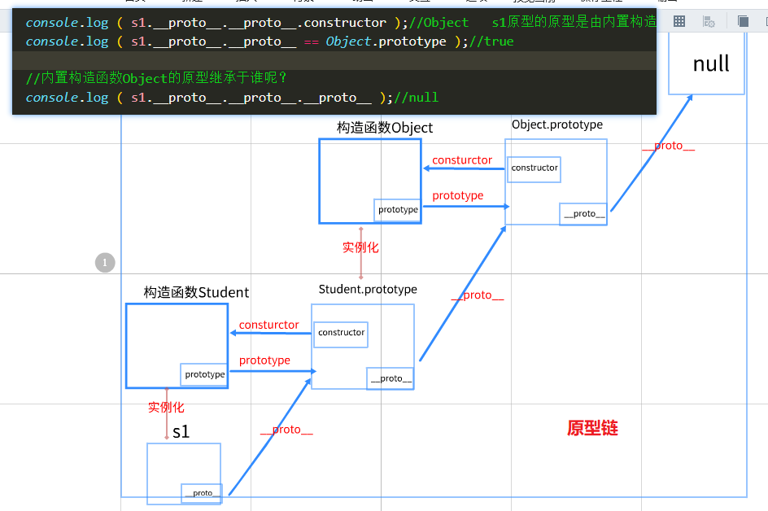
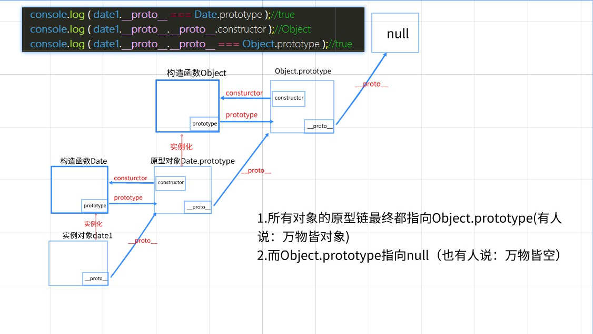
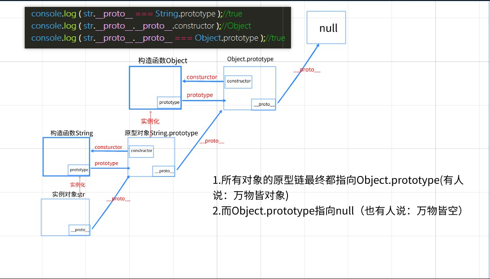
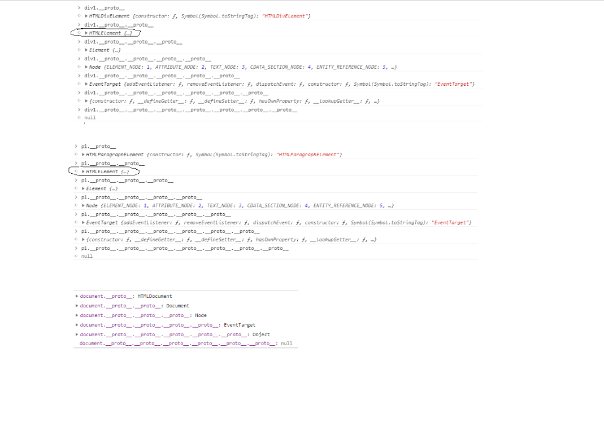

# 今日学习任务


* 1.了解面向对象的三大特征
  * 封装
    * 将某个具体功能封装在对象中，只对外部暴露指定的接口，外界在使用的时候，只考虑接口怎么用，不用考虑内部怎么实现
  * ==继承==
    * 一个对象拥有其他对象的属性和方法
  * 多态
    * 一个对象在不同情况下的多种状态
* 2.==了解原型链==
  * 原型链的作用：了解`实例化对象`,`构造函数`,`原型对象`三者之间的关系


# 01-面向对象三大特征(继承)


## 1.1-面向对象三大特征介绍

​	a.封装：将某个具体功能封装在对象中，只对外部暴露指定的接口，外界在使用的时候，只考虑接口怎么用，不用考虑内部怎么实现（前面学习的api其实就是一种封装思想）
​        b.继承：一个对象拥有其他对象的属性和方法
​        c.多态：一个对象在不同情况下的多种状态

```html
<!DOCTYPE html>
<html lang="en">
<head>
    <meta charset="UTF-8">
    <title>Title</title>
</head>
<body>


<script>
    /*面向对象三大特征
        a.封装：将某个具体功能封装在对象中，只对外部暴露指定的接口，外界在使用的时候，只考虑接口怎么用，不用考虑内部怎么实现
        b.继承：一个对象拥有其他对象的属性和方法
        c.多态：一个对象在不同情况下的多种状态
     */

    /*多态：一个对象在不同情况的多种状态*/
    //示例：饲养员给动物喂食物
    
    //动物
    function Animal ( name ) {
        this.name = name;
    };

    //猫
    var cat = new Animal('猫咪');
    cat.eat = function ( food ) {
        console.log ( "喵喵猫" + "我吃了" + food );
    };

    //狗
    var dog = new Animal('小狗狗');
    dog.eat = function ( food ) {
        console.log ( "汪汪汪" + "我吃了" + food );
    };

    //饲养员
    function Person (  name ) {
        this.name = name;
    };
    Person.prototype.work = function (animal,food ) {
        //animal接收一个由Anmiaml构造函数生成的实例化对象，调用它的eat方法
        //同一对象表现出来不同的状态，就叫做多态
        animal.eat(food);
    };

    var p1 = new Person('林绿裙');
    p1.work(cat, '饼干');
    p1.work(dog, '翔');


</script>
</body>
</html>
```


## 1.2-继承的三种实现方式

* **继承：让一个对象拥有另一个对象的属性和方法**
* **本小节知识点**
  * 1.混入式继承
    * 解决方案：遍历父对象所有属性，添加到子对象中
    * 弊端：每继承一次，就要执行一次循环
  * 2.替换原型
    * 解决方案：将子对象的构造函数的原型替换成父对象
    * 弊端：会丢失原型之前的成员变量
  * 3.混合式：混入+替换原型
    * 解决方案：遍历父对象所有的属性，添加到子对象的构造函数中

```html
<!DOCTYPE html>
<html lang="en">
<head>
    <meta charset="UTF-8">
    <title>Title</title>
</head>
<body>


<script>
    //继承：让一个对象拥有另一个对象的属性和方法
    var wangjianlin = {
        house:{
            address:'北京一环',
            price:100000000
        },
        car:{
            brand:'劳斯莱斯',
            price:5000000
        }
    };
    var wangsicong = {
        girlFriends:['雪梨','豆得儿','林更新','王建刚','赵铁柱']
    };
    //wangsicong这个对象想要继承wangjianlin这个对象的属性和方法

    //1.混入式
    //解决方案：遍历wangjianlin的所有属性值，添加给wangsicong对象
    //弊端：每继承一次，就要执行一次循环
/*
    for (var key in wangjianlin){
        wangsicong[key] = wangjianlin[key];
    }
    console.log ( wangsicong );
*/

    //2.替换原型
    //解决方案：将wangjianlin对象作为构造函数的原型
    //弊端：会丢失原型之前的成员变量
/*
    function SonWang (name,gfs  ) {
        this.name = name;
        this.gfs = gfs;
    };
    //每一个SonWang构造函数实例化的对象都有一个花钱的方法，那这个方法就可以写在原型中
    SonWang.prototype.flowerMoney = function (  ) {
        console.log ( "我很会花钱哄女孩子吃六块钱的麻辣烫…………" );
    }

    //让wangjianlin对象成为SonWang构造函数的原型，所有SonWang构造的实例化对象都可以访问wangjianlin的成员变量
    SonWang.prototype  = wangjianlin;

    //实例化对象
    var son1 = new SonWang('聪聪',['雪梨','豆得儿','林更新','王建刚','赵铁柱']);
    console.log ( son1 );
    var son2 = new SonWang('班长',['苍老师','吉泽老师','结衣老师','白石老师']);
    console.log ( son2 );
*/


    //3.  混合式（混入+替换原型）
    //解决方案：遍历wangjianlin对象所有的属性值,添加给构造函数的原型
    function SonWang (name,gfs  ) {
        this.name = name;
        this.gfs = gfs;
    };
    //每一个SonWang构造函数实例化的对象都有一个花钱的方法，那这个方法就可以写在原型中
    SonWang.prototype.flowerMoney = function (  ) {
        console.log ( "我很会花钱哄女孩子吃六块钱的麻辣烫…………" );
    }

   //将wangjianlin对象的所有属性添加到SonWang构造函数的原型中
    for(var key in wangjianlin){
        SonWang.prototype[key] = wangjianlin[key];
    }

    //实例化对象
    var son1 = new SonWang('聪聪',['雪梨','豆得儿','林更新','王建刚','赵铁柱']);
    console.log ( son1 );
    var son2 = new SonWang('班长',['苍老师','吉泽老师','结衣老师','白石老师']);
    console.log ( son2 );
</script>
</body>
</html>
```

## 1.3-混合式继承函数封装

* 封装一个混合式继承的函数，实现代码复用

```javascript

/**混合式继承
     *
     * @param method 要继承的子对象构造函数
     * @param father 被继承的父对象
     */
    function extend (method,father  ) {
        for(var key in father){
            method.prototype[key] = father[key];
        }
    }

//继承：让一个对象拥有另一个对象的属性和方法
    var wangjianlin = {
        house:{
            address:'北京一环',
            price:100000000
        },
        car:{
            brand:'劳斯莱斯',
            price:5000000
        }
    };
    var wangsicong = {
        girlFriends:['雪梨','豆得儿','林更新','王建刚','赵铁柱']
    };
    //wangsicong这个对象想要继承wangjianlin这个对象的属性和方法
    //解决方案：遍历wangjianlin对象所有的属性值,添加给构造函数的原型
    function SonWang (name,gfs  ) {
        this.name = name;
        this.gfs = gfs;
    };
    //每一个SonWang构造函数实例化的对象都有一个花钱的方法，那这个方法就可以写在原型中
    SonWang.prototype.flowerMoney = function (  ) {
        console.log ( "我很会花钱哄女孩子吃六块钱的麻辣烫…………" );
    }
    //将wangjianlin对象的所有属性添加到SonWang构造函数的原型中
    // for(var key in wangjianlin){
    //     SonWang.prototype[key] = wangjianlin[key];
    // }
    //调用封装好的继承函数
    extend(SonWang,wangjianlin);

    //实例化对象
    var son1 = new SonWang('聪聪',['雪梨','豆得儿','林更新','王建刚','赵铁柱']);
    console.log ( son1 );
    var son2 = new SonWang('班长',['苍老师','吉泽老师','结衣老师','白石老师']);
    console.log ( son2 );

    /**混合式继承
     *
     * @param method 要继承的子对象构造函数
     * @param father 被继承的父对象
     */
    function extend (method,father  ) {
        for(var key in father){
            method.prototype[key] = father[key];
        }
    }
```


# 02-原型链


## ==1.1-原型链介绍==

* *本小节知识点*
  * 1.原型链：每一个对象都有原型，原型本身又是对象，所以原型又有原型，以此类推形成一个链式结构，称为原型链
  * 2.对象访问原型链中的成员规则：就近原则
    * 当访问一个对象的成员变量时，会首先访问它自身的成员变量，如果有则访问。没有则在原型中寻找，能找到就访问，不能找到则继续往原型的原型中寻找，以此类推，如果找到原型链的顶端还是找不到，则程序报错:`xxx is not a function`



```html
<!DOCTYPE html>
<html lang="en">
<head>
    <meta charset="UTF-8">
    <title>Title</title>
</head>
<body>

<script>
    //1.原型链：每一个对象都有原型，原型本身又是对象，所以原型又有原型，以此类推形成一个链式结构，称为原型链

    function Student (name,age  ) {
        this.name = name;
        this.age = age;
    }
    //给原型添加学习方法
    Student.prototype.study = function (  ) {
        console.log ( "好好学习,天天向上" );
    }
    //实例化学生对象
    var s1 = new Student('班长',20);
    //给班长动态添加一个性别属性
    s1.gender = '男';

    console.log ( s1.name );//不会报错，自己有name属性
    console.log ( s1.gender );//不会报错，自己有gender属性
    s1.study();//不会报错，因为原型中有study方法
   // s1.eat();//程序报错（s1.eat is not a function），自己没有这个方法，原型也没有
    console.log ( s1.girlFriend );//undefined 对象取值语法，没有属性则获取undefined
    s1.toString();//不会报错，为什么？  //s1本身没有toString方法，原型也没有toString方法，但是他没有报错
    //原因：s1对象原型的原型中有toString方法
    console.log ( s1 );

    console.log ( s1.__proto__.__proto__.constructor );//Object   s1原型的原型是由内置构造函数Object生成的
    console.log ( s1.__proto__.__proto__ == Object.prototype );//true

    //内置构造函数Object的原型继承于谁呢？
    console.log ( s1.__proto__.__proto__.__proto__ );//null

    console.log ( {}.constructor );//Object构造函数       {}相当于new Object()的一种简写形式

</script>
</body>
</html>
```


## 1.2-原型链详解：内置对象的原型链


* **本小节知识点：内置对象的原型链**（附图解说明）
  * 1.通过查看Array的原型链
    * 了解构造函数的原型本身是一个对象，只要是对象就有原型
  * 2.通过查看Date的原型链
    * 学会举一反三，所有的内置对象(Math Array 基本包装类型等)的原型链都是一样的，最终都指向Object
  * 3.通过查看String的原型链：了解这里的String值得是内置对象String（是一个基本包装类型），其他的Number、Boolean原型链和String是一样的
    * 只有对象才有原型，这里一定要把基本数据类型string、number、boolean，和基本包装类型（特殊的引用类型对象）String、Number、Boolean区分开来，不要搞混淆
* **思考题：为什么arr.toString()方法和对象的toString()方法得到的结果不同**


### 1.Array的原型链


```javascript
//1.Array
    var arr = new Array(10,20,30);
    console.log ( arr );
    //查看arr的原型
    console.log ( arr.__proto__.constructor );//Array
    console.log ( arr.__proto__ === Array.prototype );
    //查看arr的原型的原型
    console.log ( arr.__proto__.__proto__.constructor );//Object
    console.log ( arr.__proto__.__proto__ === Object.prototype );//true
```


### 2-Date的原型链


```javascript
//2.Date
    var date1 = new Date();
    //细节：日期对象直接console.log会转成string，查看对象需要使用console.dir打印
    console.dir(date1);
    console.log ( date1.__proto__ === Date.prototype );//true
    console.log ( date1.__proto__.__proto__.constructor );//Object
    console.log ( date1.__proto__.__proto__ === Object.prototype );//true
```




### 3-String对象原型链


```javascript
//3.String
    var str = new String('123');
    console.log ( str );
    console.log ( str.__proto__ === String.prototype );//true
    console.log ( str.__proto__.__proto__.constructor );//Object
    console.log ( str.__proto__.__proto__ === Object.prototype );//true
```




### 4-DOM对象原型链

```javascript
//4.界面元素
    var div1 = document.getElementById('div1');
    var p1 = document.getElementById('p1');
```




* 完整代码

```html

<!DOCTYPE html>
<html lang="en">
<head>
    <meta charset="UTF-8">
    <title>Title</title>
</head>
<body>

<div id="div1"></div>
<p id="p1"></p>

<script>
    /*查看内置对象的原型链*/

    //1.Array
    var arr = new Array(10,20,30);
    console.log ( arr );
    //查看arr的原型
    console.log ( arr.__proto__.constructor );//Array
    console.log ( arr.__proto__ === Array.prototype );
    //查看arr的原型的原型
    console.log ( arr.__proto__.__proto__.constructor );//Object
    console.log ( arr.__proto__.__proto__ === Object.prototype );//true

    //2.Date
    var date1 = new Date();
    //细节：日期对象直接console.log会转成string，查看对象需要使用console.dir打印
    console.dir(date1);
    console.log ( date1.__proto__ === Date.prototype );//true
    console.log ( date1.__proto__.__proto__.constructor );//Object
    console.log ( date1.__proto__.__proto__ === Object.prototype );//true

    //3.String
    var str = new String('123');
    console.log ( str );
    console.log ( str.__proto__ === String.prototype );//true
    console.log ( str.__proto__.__proto__.constructor );//Object
    console.log ( str.__proto__.__proto__ === Object.prototype );//true

    //4.界面元素
    var div1 = document.getElementById('div1');
    var p1 = document.getElementById('p1');

</script>
</body>
</html>
```


## 1.3-函数也是对象


*本小节知识点*

* 1.function函数属于对象类型
  * 如何验证呢？
    * 对象特征：点语法动态赋值
* 2.既然函数是对象，那它是由哪一个构造函数来创建的呢？
  * Function构造函数
* 3.既然函数是对象，那么构造函数Function本身也是对象，它又是由谁构造生成的呢？
  * Object构造函数


```javascript
//1.函数是一个对象类型
    function fn (  ) {
        console.log ( "哈哈哈,我是fn函数" );
    }
    //验证：对象可以使用点语法动态添加属性
    fn.sb = '随便';
    fn.dbj = function (  ) {
        console.log ( "我是大保健" );
    };
    console.dir(fn);//打印函数对象
    console.log ( fn );//只能打印函数体代码
    console.log ( fn.sb );
    fn.dbj();
    fn();

    //2.既然函数是对象，那它是由哪一个构造函数来创建的呢？  Function构造函数
    console.log ( fn.__proto__.constructor );//Function
    console.log ( fn.__proto__ === Function.prototype );//true

    //3.查看fn原型的原型
    console.log ( fn.__proto__.__proto__.constructor );//Object
    console.log ( fn.__proto__.__proto__ === Object.prototype );//true
```


## 1.4-Function构造函数

*本小节知识点*

* 1.函数属于对象类型，它是由Function()构造函数生成
  * js中的函数都是由Function()构造函数实例化的对象，包括`Object`构造函数
* 2.介绍Function构造函数的语法

```html
<!DOCTYPE html>
<html lang="en">
<head>
    <meta charset="UTF-8">
    <title>Title</title>
</head>
<body>


<script>
    //函数属于对象类型，它是由Function()构造函数生成（每一个函数都是一个Function对象）

    /**1.创建一个Function对象
     * 语法：   new Function ([arg1[, arg2[, ...argN]],] functionBody)
     * 所有的参数都是字符串
     * @param 前面的都代表fn的参数
     * @param 最后一个代表fn的函数体
     */
   var fn =  new Function('a','b','console.log(a*b);return a + b;');
    console.log ( fn );

    console.log ( fn ( 10, 20 ) );//30

    //2.复习函数常用的两种声明方式
    function fn1 (  ) {

    };

    var fn2 = function (  ) {

    };

</script>
</body>
</html>
```


## ==1.5-完整原型链==


*本小节知识点*

* 1.完整原型链：了解`实例化对象`,`构造函数`,`原型对象`三者之间的关系
* 2.完整原型链的总结（不考虑个别特殊情况）
  * 对象与构造函数关系(js中的对象都是构造函数生成)
    * a.原型对象由`Object`构造函数生成
    * b.函数对象由`Function`构造函数生成
    * c.实例对象由`对应的构造函数`生成
  * 原型与构造函数关系
    * a.只要是`构造函数`就有`prototype`属性指向自身的原型对象
    * b.只要是`原型对象`就有`constructor`属性指向对应的构造函数
    * c.只要是`对象`就有____proto____指向与之对应的构造函数的原型对象
      * 特殊情况：Object.prototype的原型对象是null
    * d.函数本身也是对象


```javascript
//（1）对象都是由构造函数生成  （2）构造函数本身也是对象
    //1.Person构造函数对象由Function构造函数生成
    function Person(name,age){
        this.name = name;
        this.age = age;
    };

    //2.p1对象由Person构造函数生成
    var p1 = new Person('张三',16);
    //3.obj1对象由Object对象生成
    var obj1 = new Object();
    //4.构造函数(Person构造函数，Function构造函数)的原型对象由Object构造函数生成
    console.log ( Person.__proto__.__proto__.constructor );//Object
    console.log ( Function.__proto__.__proto__.constructor );//Object
    //5.构造函数对象（Person对象,Function对象，Object对象）由Function构造函数生成
    console.log ( Object.__proto__.constructor );//Function
    console.log ( Function.__proto__.constructor );//Function
    console.log ( Person.__proto__.constructor );//Function
```


## 1.6-instanceof运算符原理

*本小节知识点*

* instanceof语法： `对象` `instanceof` `构造函数`
* 作用：检测构造函数的原型prototype在不在这个对象的原型链上


```javascript
	//1.示例
    var arr = [10,20,30];
    //数组原型链  arr->Arr.prototype->Object.prototype->null
    console.log ( arr instanceof Array );//true
    console.log ( arr instanceof Object );//true

    //2.示例
    //根据instanceof语法：左边Function表示对象，右边Function表示构造函数
    //Function原型链  Function对象->Function.prototype->Object.prototype->null
    console.log ( Function instanceof Function );//true
    console.log ( Function instanceof Object );//true

    //3.示例
    //根据instanceof语法：左边Object表示对象，右边Object表示构造函数
    //Object原型链 Object对象->Function.prototype->Object.prototype->null
    console.log ( Object instanceof Object );//true
    console.log ( Object instanceof Function );//true
```


# 第二天学习总结


* 1.面向对象三大特征

  * a.封装：将某个功能封装到对象或函数中
  * b.继承：一个对象拥有另一个对象的所有成员变量（属性和方法）
  * c.多态：一个对象在不同情况的多种状态

* 2.实现继承的几种方式

  * a.混入式继承
    * 解决方案：遍历父对象的所有属性值，添加给子对象
    * 弊端：每继承一次，就要执行一次循环
    * 应用场景：父对象只有一个子对象
  * b.替换原型
    * 解决方案：将父对象作为子对象构造函数的原型
    * 弊端：会丢失原型之前的成员变量
    * 应用场景：自定义内置对象
  * c.混合式（混入+替换原型）
    * 解决方案：遍历父对象所有的属性值,添加给构造函数的原型
    * 应用场景：父对象有多个子对象

* 3.原型链

  * 原型链：每一个对象都有原型，原型本身又是对象，所以原型又有原型，以此类推形成一个链式结构，称为原型链

  * 对象在原型链中的访问规则：就近原则

    * 当访问对象成员变量时，会先从自己的属性中查找，如果有就访问，没有就访问自己原型的，如果原型中没有，则访问原型的原型，以此类推，如果访问到原型链的顶端还是没有，则程序报错`xxxx is not undefined`

  * 完整原型链：了解

    ```
    对象
    ```

    、

    ```
    构造函数
    ```

    、

    ```
    原型对象
    ```

    之间的关系

    * a.只要是`构造函数`，就有`prototype`属性指向自身的`原型对象`
    * b.只要是`原型对象`，就有`constructor`属性指向自身对应的`构造函数`
    * c.只要是对象,就有____proto____属性指向与之对应的构造函数的原型对象
      * 特殊情况：Object.prototype的原型对象是null
    * d.函数本身也是对象
      * 构造函数属于函数