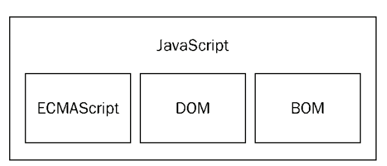
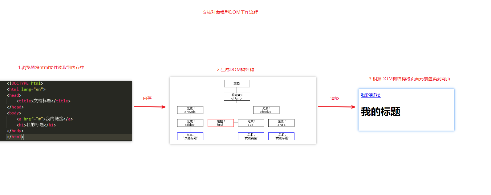
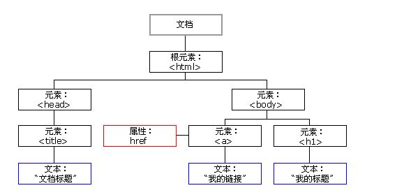
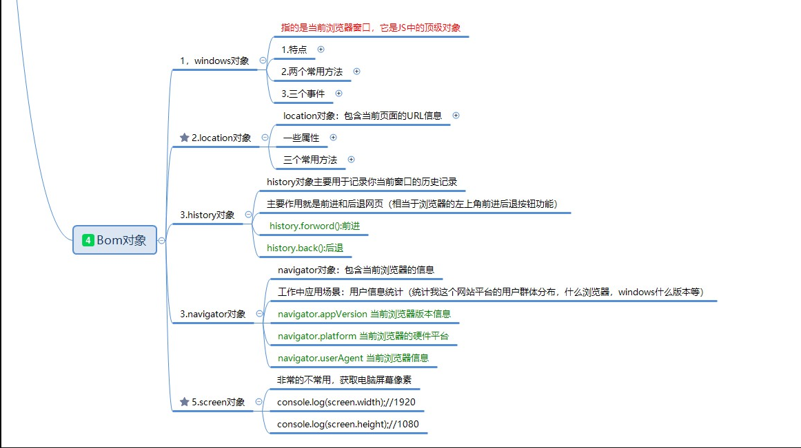
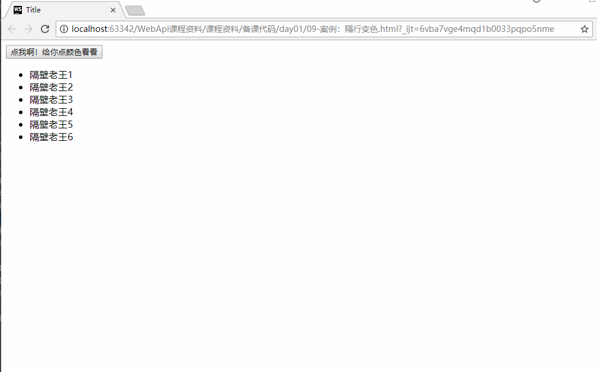
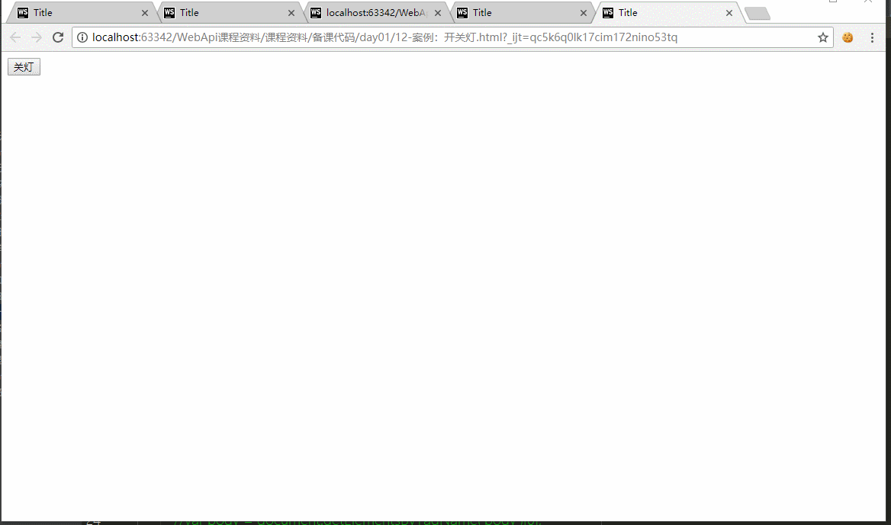

# 今日学习任务

* [ ] 1.获取页面元素
  * [ ] 根据id获取页面元素
  * [ ] 根据标签名tagName获取元素
  * [ ] 根据类名className获取元素
  * [ ] 根据name属性值获取表单元素
  * [ ] 根据选择器selector获取元素
* [ ] 2.元素属性操作
  * [ ] id
  * [ ] className
  * [ ] href
  * [ ] src
  * [ ] innerText
  * [ ] value
  * [ ] disabled
  * [ ] checked
  * [ ] selected
* [ ] 3.事件
  * [ ] 能够说出组成事件的三要素
  * [ ] 能够给页面元素注册事件
    * [ ] 鼠标单击onclick
    * [ ] 鼠标双击ondblclick
    * [ ] 鼠标移入onmouseover
    * [ ] 鼠标移出onmouseout
    * [ ] 成为焦点onfocus
    * [ ] 失去焦点onblur
* [ ] 4.网页案例
  * [ ] 隔行变色：事件
  * [ ] 禁用表单事件：disabled
  * [ ] 开关灯:一个按钮实现两种功能


# ==01-WebApi课程介绍==

## 1.1-WebAPI概念介绍

* API（Application Programming Interface,应用程序编程接口）是一些预先定义的函数，目的是提供应用程序与开发人员基于某软件或硬件得以访问一组例程的能力，而又无需访问源码，或理解内部工作机制的细节。
  * 任何开发语言都有自己的API
  * API的特征输入和输出(I/O)
  * API的使用方法(console.log())
* WebAPI概念
  * 浏览器提供的一套操作浏览器功能和页面元素的API(BOM和DOM)
  * 此处的Web API特指浏览器提供的API(一组方法)，Web API在后面的课程中有其它含义

## 1.2-JavaScript组成三个部分



* 1.ECMAScript - JavaScript的核心
  * 定义了javascript的语法规范
  * JavaScript的核心，描述了语言的基本语法和数据类型，ECMAScript是一套标准，定义了js语言的标准
* 2.DOM - 文档对象模型
  * 一套操作页面元素的API
  * DOM可以把HTML看做是文档树，通过DOM提供的API可以对树上的节点进行操作
* 3.BOM - 浏览器对象模型
  * 一套操作浏览器功能的API
  * 通过BOM可以操作浏览器窗口，比如：弹出框、控制浏览器跳转、获取分辨率等

## 1.3-DOM

 

* Docuemnt Object Model（文档对象模型）
  * 当网页被加载时，浏览器会创建页面的文档对象模型（Document Object Model）。
  * HTML DOM 模型被构造为对象的树。
* HTML DOM 树



* 通过可编程的对象模型，JavaScript 获得了足够的能力来创建动态的 HTML。
  * JavaScript 能够改变页面中的所有 HTML 元素
  * JavaScript 能够改变页面中的所有 HTML 属性
  * JavaScript 能够改变页面中的所有 CSS 样式
  * JavaScript 能够对页面中的所有事件做出反应

## 1.4-BOM

* browerser object model:浏览器对象模型
* BOM定义了一套操作浏览器功能的API




# 02-获取页面元素

| 语法                     | 示例                                   | 描述                               |
| ------------------------ | -------------------------------------- | ---------------------------------- |
| getElementById()         | document.getElementById('box')         | 根据`id`获取元素                   |
| getElementsByTagName()   | document.getElementsByTagName('li')    | 根据`标签名`获取元素               |
| getElementsByClassName() | document.getElementsByClassName('one') | 根据`类名`获取元素                 |
| getElementsByName()      | document.getElementsByName('sex')      | 根据`name属性值`获取`表单元素`     |
| querySelector()          | document.querySelector('选择器')       | 根据选择器获取满足条件`第一个`元素 |
| querySelectorAll()       | document.querySelectorAll('选择器')    | 根据选择器获取满足条件`所有`元素   |


## 1.1-根据id获取页面元素


* 语法:`document.getElementById('id名');`
  * 如果没有这个id，那么会得到一个null
* 由于在html的标签元素中id具有唯一性，所以我们可以直接使用id来表示这个元素
  * 这种用法不推荐，有些浏览器不支持

```html
<!DOCTYPE html>
<html lang="en">
<head>
    <meta charset="UTF-8">
    <title>Title</title>
</head>
<body>

<div id="div1">我是div1</div>
<div id="div2">我是div2</div>

</body>

<script>

    /**1.getElementById:通过id获取元素
     * 参数：元素id字符串
     * 返回值：元素对象（又称为dom对象）/null
     */
    var div1 = document.getElementById('div1');
    console.log ( div1 );
    console.log ( typeof  div1 );//object

    //2.如果没有这个id，那么会得到一个null
    var box = document.getElementById('box');
    console.log ( box );//null

    //3.由于在html的标签元素中id具有唯一性，所以我们可以直接使用id来表示这个元素
    //这种用法不推荐，有些浏览器不支持
    console.log ( div2 );
</script>
</html>
```


## 1.2-根据标签名tagName获取页面元素


* 语法:`document.getElementsByTagName('标签名')`
* 细节：
  * （1）id具有唯一性所以获取到的要么是null要么是单个元素
  * （2）标签名可以在页面存在多个，所以获取到的一定是一个`伪数组`，如果没有则是空数组
* 总结
  * 1.如果使用document调用getElementsByTagName得到的就是整个html文档中所有的标签名元素
  * 2.如果使用某一个元素对象调用getElementsByTagName得到的就是该元素下所有的标签名元素
  * 3.getElementById只能由document来调用，否则会报错

```html
<!DOCTYPE html>
<html lang="en">
<head>
    <meta charset="UTF-8">
    <title>Title</title>
</head>
<body>

<ul id="oldWang">
    <li id="id1">隔壁老王1</li>
    <li>隔壁老王2</li>
    <li>隔壁老王3</li>
    <li>隔壁老王4</li>
    <li>隔壁老王5</li>
</ul>

<ul>
    <li>隔壁老张1</li>
    <li>隔壁老张2</li>
    <li>隔壁老张3</li>
    <li>隔壁老张4</li>
    <li>隔壁老张5</li>
</ul>

</body>

<script>
    /**1.getElementsByTagName通过标签名获取元素
     *参数：标签名字符串
     * 返回值：标签数组(伪数组)
     *      * 细节：（1）id具有唯一性所以获取到的要么是null要么是单个元素
     *                  （2）标签名可以在页面存在多个，所以获取到的一定是一个数组，如果没有则是空数组
     *
     */
    var liList = document.getElementsByTagName('li');
    console.log ( liList );//一定是一个数组，所以找不到则是空数组

    //console.log ( liList.slice () );//程序会报错，伪数组没有数组的API

    //2.假如我只想获取某一个元素下所有标签名的元素，可以先获取父元素对象，然后调用父元素对象的getElementsByTagName方法
    //2.1 先通过id获取ul标签
    var oldWang = document.getElementById('oldWang');
    //2.2 调用oldWang的getElementsByTagName方法
    var wangList = oldWang.getElementsByTagName('li');
    console.log ( wangList );

    /*总结
    1.如果使用document调用getElementsByTagName得到的就是整个html文档中所有的标签名元素
    2.如果使用某一个元素对象调用getElementsByTagName得到的就是该元素下所有的标签名元素
    3.getElementById只能由document来调用，否则会报错
     */
    //console.log ( wangList.getElementById ( "id1" ) );//这样写会报错，id只能通过document来获取

</script>
</html>
```


## 1.3-根据类名className获取元素

* 语法：`document.getElementsByClassName ( "类名" )`
  * 返回的就是一个伪数组
* 小技巧：如果API写的是Emement复数的形式，也就是后面加了s（Emements）那么它返回的就是一个伪数组 否则就是单个对象，一般只有id才会是单个对象，其他方式获取（标签名 类名）都是伪数组
* 注意点:根据类名获取元素存在浏览器兼容问题，IE8及以下不支持，一般很少使用

```html
<!DOCTYPE html>
<html lang="en">
<head>
    <meta charset="UTF-8">
    <title>Title</title>
</head>
<body>

<ul id="ul1">
    <li class="li1">隔壁老王1</li>
    <li class="li1">隔壁老王2</li>
    <li class="li1">隔壁老王3</li>
    <li class="li1">隔壁老王4</li>
    <li class="li1">隔壁老王5</li>
</ul>

<ul id="ul2">
    <li class="li1">隔壁老张1</li>
    <li class="li1">隔壁老张2</li>
    <li class="li1">隔壁老张3</li>
    <li class="li1">隔壁老张4</li>
    <li class="li1">隔壁老张5</li>
</ul>

</body>

<script>
    /*本小节知识点：根据类名classNmae获取元素
    1.小技巧：如果API写的是Emement复数的形式，也就是后面加了s（Emements）那么它返回的就是一个伪数组
    否则就是单个对象，一般只有id才会是单个对象，其他方式获取（标签名 类名）都是伪数组

    2.根据类名获取元素存在浏览器兼容问题，IE8及以下不支持，一般很少使用

     */

    //1.获取ul1
    var ul1 = document.getElementById('ul1');
    //2.根据类型获取标签  返回的是一个伪数组
    console.log ( ul1.getElementsByClassName ( "li1" ) )//获取ul1元素下的所有类名为li1的标签
    console.log ( document.getElementsByClassName ( "li1" ) )//获取整个文档中类名为li1的标签
    //3.根据类型获取标签getElementsByClassName，尽量少用，改用其他方式代替
    //原因：存在浏览器兼容性问题，IE8及之前不支持
</script>
</html>
```


## 1.4-根据name属性值获取表单元素


* 语法:`document.getElementsByName('表单元素name属性的值');`
  * name属性是表单元素特有的默认属性，返回值也是一个伪数组

```html
<!DOCTYPE html>
<html lang="en">
<head>
    <meta charset="UTF-8">
    <title>Title</title>
</head>
<body>

<input type="text" name="one">
<input type="password" name="one">
<input type="radio" name="one">
<input type="checkbox" name="one">


</body>

<script>
    /*使用name属性来获取元素，返回值也是一个伪数组
        * name属性是表单元素特有的默认属性
     */
    var nameList = document.getElementsByName('one');
    console.log ( nameList );
</script>
</html>
```


## 1.5-根据选择器获取元素


```javascript
/*通过选择器获取标签
    querySelector:只会找到满足条件的第一个对象，如果找不到则返回null
    querySelectorAll：会找到所有满足条件的对象伪数组，如果找不到则返回空数组
    MDN官网介绍:<https://developer.mozilla.org/zh-CN/docs/Web/API/Document/querySelector>
    */
```

```html
<!DOCTYPE html>
<html lang="en">
<head>
    <meta charset="UTF-8">
    <title>Title</title>
</head>
<body>

<p class="one" id="p1"></p>

<div class="one" id="div1"></div>

</body>

<script>
    /*通过选择器获取标签
    querySelector:只会找到满足条件的第一个对象，如果找不到则返回null
    querySelectorAll：会找到所有满足条件的对象伪数组，如果找不到则返回空数组
    MDN官网介绍:<https://developer.mozilla.org/zh-CN/docs/Web/API/Document/querySelector>
    */

    //1. 获取界面上第一个类为 one的元素
    console.log ( document.querySelector ( ".one" ) );
    //获取界面上第一个id为p1的元素
    console.log ( document.querySelector ( "#p1" ) );

    //2.获取界面上所有类为 one的元素
    console.log ( document.querySelectorAll ( ".one" ) );
</script>
</html>
```


# ==03-操作元素属性==

| 语法（普通元素）    | 示例            | 描述                      |
| ------------------- | --------------- | ------------------------- |
| 元素.style.样式属性 | box.style.width | 获取元素`css样式`属性     |
| className           | box.className   | 获取元素`类名`            |
| innerText           | box.innerText   | 获取元素的文本            |
| src                 | img.src         | 获取元素(图片img)的路径   |
| href                | a.href          | 获取元素（a标签）的超链接 |

| 语法（表单元素） | 示例           | 描述                                             |
| ---------------- | -------------- | ------------------------------------------------ |
| value            | input.value    | 获取表单元素(单标签)的文本                       |
| disabled         | input.disabled | 是否禁用（`布尔类型`）                           |
| checked          | input.checked  | 是否选中(`布尔类型`),radio单选框  checkbox多选框 |
| selected         | input.selected | 是否选中(`布尔类型`),select下拉选择框            |


## 1.1-元素属性操作特点


* 1.语法：`元素.属性名`(其实就是对象的取值赋值语法)
  * 设置元素属性的值:`元素.属性名 = 属性值`

* 2.特点：

  * 1.class在js中是一个关键字，如果要拿到类名需要使用className

  * 2.只能获取到行内样式的属性值，无法得到行外(内联/外联)样式的属性值

  * 3.一定是一个字符串，例如：`div.style.height`得到150px 得到的是一个带单位的字符串

  * 4.如果css样式的属性有 `-`

    * 例如`background-color`,`margin-top`,使用js获取和设置这些属性的时候需要使用驼峰命名(因为-符号不符合js的命名规范)

    * 例如:`div.style.backgroundColor`

* 3.注意点：修改类名需要注意会覆盖掉原本的类样式，所以一般我们不会直接修改类名，而是在原先类名的基础上加 一个类，这里需要注意多个类名之间的空格

  * 例如：`div.className += " two";//字符串拼接添加类型，注意多个类名之间的空格`

```html
<!DOCTYPE html>
<html lang="en">
<head>
    <meta charset="UTF-8">
    <title>Title</title>
</head>

<style>
    #div {
        width: 100px;
        height: 100px;
    }

    .one{
        background-color:  yellow;
        border: 5px solid red;
    }

    .two{
        padding: 10px;
    }
</style>
<body>
<div id="div" class="one" style="background: green;height: 150px">我是一个div</div>
</body>

<script>
    //1.获取div元素，得到的是一个对象
    var div = document.getElementById('div');
    console.log ( div );

    //2.获取该元素的属性
    console.log ( div.id );//div
    console.log ( div.style );//元素的style属性也是一个对象（对象的属性可以是任何数据类型）
    console.log ( div.className );//获取类名需要使用calssName

    //3.使用属性名的方式，可以获取行内属性值，不能获取行外（内联/外联）属性值
    console.log ( div.style.height );//150px  得到的是一个带单位的字符串
    console.log ( div.style.width );//空字符串

    //4.获取到的属性值也可以使用js赋值的方式来修改
    div.style.width = "200px";
    //如果属性名有小短线的，例如board-   font-  text-   ,需要去掉短线将后面首字母大写
    //因为  - 不符合js命名规范，所以要转成驼峰命名
    div.style.backgroundColor = "purple";//行内样式属性的值都是字符串

    //5.修改类名注意点
    //a.如果类名修改，那么对应的样式也会修改
    //div.className = 'two';
    //b.如果想要添加类名，可以使用字符串拼接的方式，需要注意中间的空格
    div.className += ' two';

</script>
</html>
```

## 1.2-普通元素属性操作


```html
<!DOCTYPE html>
<html lang="en">
<head>
    <meta charset="UTF-8">
    <meta name="viewport" content="width=device-width, initial-scale=1.0">
    <meta http-equiv="X-UA-Compatible" content="ie=edge">
    <title>Document</title>

</head>
<body>
    <div id="box" class="one" style="width: 100px;height: 100px;background-color:red">我是班长</div> 
    <span id="sp">我是span</span>
    <a href="#">点我有惊喜</a>
           

    <script>
        //1.获取元素
        var box = document.getElementById('box');
        var sp = document.getElementById('sp');
        var a = document.getElementsByTagName('a')[0];
        var img = document.getElementsByTagName('img')[0];

        //2.html属性操作

        console.log(box.id);
        console.log(box.className);
        // innertText:获取双标签文本
        console.log(box.innerText);
        sp.innerText = '坤哥';//修改文本

        // href: a标签链接
        console.log(a.href);//#
        a.href = 'http://www.itheima.com';

        //src: img图片链接
        console.log(img.src);//获取到的是图片真实的绝对路径
        img.src = 'images/002.jpg';
        
    </script>
</body>
</html>
```


## 1.3-表单元素属性操作


```html
<!DOCTYPE html>
<html lang="en">
<head>
    <meta charset="UTF-8">
    <meta name="viewport" content="width=device-width, initial-scale=1.0">
    <meta http-equiv="X-UA-Compatible" content="ie=edge">
    <title>Document</title>
</head>
<body>
    <!--表单元素中有一种特殊的状态属性：disable(不可用)  只要写上去就会生效
            * 原理：这种属性只有两种值 true和false，默认不写就是false，写上去就是true
            * 类似于的这些属性还有selected（option选中），checked（radio选中）
      * 如果想用js代码来改变这种状态属性，只需要设置他们的值是true或者false即可
    -->
    <input type="text" value="请输入用户名" id="username">
    <div>
        <input type="radio" value="男" name="sex">男
        <input type="radio" value="女" name="sex">女
    </div>
    <div>
        <input type="checkbox" value="确定" name="confirm">商品1
        <input type="checkbox" value="取消" name="confirm">商品2
    </div>
    <div>
        <select name="job" id="job">
            <option>前端</option>
            <option>安卓</option>
            <option>php</option>
            <option selected>UI</option>
        </select>
    </div>
    
    <script>
        //1.获取页面元素
        var username = document.getElementById('username');
        var sexList = document.getElementsByName('sex');
        var confirmList = document.getElementsByName('confirm');
        var optionList = document.getElementsByTagName('option');//选择框

        //2.表单元素常用属性

        //2.1 value:获取单标签文本
        console.log(username.value);

        //2.2 disable:是否禁用  true：禁用 flase：可用
        username.disabled = true;

        //2.3 checked：用于radio和checkbox选择框，是否选中
        sexList[1].checked = true;
        for(var i = 0;i<sexList.length;i++){
            console.log(sexList[i].checked);
        };

        confirmList[0].checked = true;
        for(var i = 0;i<confirmList.length;i++){
            console.log(confirmList[i].checked);
        };

        //2.4 selected:用于option选择框，是否选中
        optionList[2].selected = true;
        for(var i = 0;i<optionList.length;i++){
            console.log(optionList[i].selected);
        };
        
    </script>
</body>
</html>
```


# ==04-事件介绍及注册事件==


* 1.事件：js处理用户交互的一种机制
  * 交互：什么元素在什么时刻做什么事
* 2.事件的三要素：组成事件的三要素
  * 事件源：什么元素（div p）
  * 事件类型：什么时刻（鼠标点击onclick 鼠标移入：onmouseover）
  * 事件处理函数：做什么事（一段代码：函数）
* 3.注册事件:本质是给元素属性赋值
  * `事件源.事件类型 = 事件处理函数`
    * `box.onclick = function(){}`


```html
<!DOCTYPE html>
<html lang="en">
<head>
    <meta charset="UTF-8">
    <title>Title</title>
</head>
<body>

<div id="box" style="width: 100px;height: 100px;background-color: red;"></div>

<button id="btn">我是按钮</button>

<script>
    //获取元素
    var box = document.getElementById('box');
    //设置颜色
    // box.style.backgroundColor = 'green';


    /*1.交互： 什么元素在什么时刻做什么事
    2.事件： js处理用户交互的一种机制
        * ***事件三要素***
        事件源：什么元素
        事件类型：什么时刻  （单击  鼠标移入  双击）
        事件处理（响应）：做什么事     ----事件处理函数
   3.如何注册事件
        事件源.事件类型 = 事件处理函数
  4.事件工作原理：
        a.注册事件的时候，不会触发（函数体代码不会执行）
        b.当页面全部加载完毕之后，用户触发这个事件之后，浏览器会捕捉到这个事件，自动的帮我们执行这个事件的处理函数
     */

    //box（班长）在鼠标单击（在困了）会睡觉
    box.onclick = function (  ) {
        alert('我是班长，我困了，我要睡觉');
    };

    //鼠标移入
    box.onmouseover = function (  ) {
        box.style.backgroundColor = 'green';
    };

    //我们无需调用去调用这个方法，当用户触发这个事件之后，浏览器会自动帮我们执行这个代码
    // box.onmouseover();


    var btn = document.getElementById('btn');

    btn.ondblclick = function (  ) {
        alert('我是班长，我今天要精油开背');
    }

</script>
</body>
</html>
```


# 05-网页案例


## 1.1-实际开发思路介绍

* 1.实际开发中，我们做某一个功能的时候，通常遵循以下分析思路
  * （1）明确需求
    * 我们代码的意义是完成需求，如果连需求是什么都不清楚，从何谈实现？
  * （2）根据需求整理思路
    * 明确需求之后，应该根据需求理清代码思路
    * 磨刀不误砍柴工，如果敲代码想到一行写一行，思路很容易混乱，而且容易出现bug
  * （3）根据思路敲代码
    * 思路一旦清晰，敲代码就是一个代码熟练度问题，如果忘记了某个api，可以查阅资料或者以前的笔记
* 2.如何来描述需求和整理思路
  * 网页的交互需求，其实就是事件，通常都三个大步骤`点击了(事件类型)什么元素（事件源），发生了什么事（事件处理）
  * 所以我们在整理思路的时候，应该从事件三要素触发


## 1.2-隔行变色


* 1.需求：点击按钮，让界面的li标签改变颜色，并且单数行为红色，双数行为绿色
* 2.思路
  * 1.事件源：获取界面的button元素
  * 2.事件类型：给button元素注册一个点击事件
  * 3.事件处理：获取到界面的li标签并且设置颜色

[效果预览](<file:///C:/Users/%E5%BC%A0%E6%99%93%E5%9D%A4/Desktop/%E5%BC%A0%E6%99%93%E5%9D%A4%E5%89%8D%E7%AB%AF%E5%A4%87%E8%AF%BE%E8%B5%84%E6%96%99/AB%E6%A8%A1%E5%BC%8F/03-WebApi/%E8%AF%BE%E7%A8%8B%E8%B5%84%E6%96%99/%E5%A4%87%E8%AF%BE%E4%BB%A3%E7%A0%81/day01/12-%E6%A1%88%E4%BE%8B%EF%BC%9A%E9%9A%94%E8%A1%8C%E5%8F%98%E8%89%B2.html>)




```html
<!DOCTYPE html>
<html lang="en">
<head>
    <meta charset="UTF-8">
    <title>Title</title>
</head>
<body>

<div>
    <button id="btn">点我啊！给你点颜色看看</button>
</div>

<ul>
    <li>隔壁老王1</li>
    <li>隔壁老王2</li>
    <li>隔壁老王3</li>
    <li>隔壁老王4</li>
    <li>隔壁老王5</li>
    <li>隔壁老王6</li>
</ul>

</body>

<script>
    /*需求：点击按钮，让界面的li标签改变颜色，并且单数行为红色，双数行为绿色
    * 思路
    *   1.事件源：获取界面的button元素
    *   2.事件类型：给button元素注册一个点击事件
    *   3.事件响应：获取到界面的li标签并且设置颜色
     */

    //1.获取button元素
    var btn = document.getElementById('btn');
    //2.给button注册一个点击事件
    btn.onclick = function () {
        //3.设置颜色
        //获取界面的li标签
        var liList = document.getElementsByTagName('li');
        //循环数组逐个改变颜色
        for(var i = 0;i<liList.length;i++){
            //获取到具体的每一个li标签元素
            var li = liList[i];
            if(i%2 == 0){
                //双数行
                li.style.background = 'greenyellow';
            }else{
                //单数行
                li.style.background = 'hotpink';
            }
        }
    }
</script>
</html>
```


## ==1.3-按钮禁用表单事件==


[效果预览](file:///C:/Users/张晓坤/Desktop/张晓坤前端备课资料/AB模式/03-WebApi/课程资料/备课代码/day01/13-案例：禁用表单事件.html)

需求分析：
                1.点击启用：设置所有的表单元素distabled属性false
                2.点击禁用：设置所有的表单元素distabled属性true

思路分析：事件三要素
                 1 获取元素：
                 2 注册事件：
                 3 事件处理：

```html
<!DOCTYPE html>
<html lang="en">
<head>
    <meta charset="UTF-8">
    <title>Title</title>
</head>
<body>

<!--1.HTML中的表单元素有一些特殊的属性，表示的是表单元素的两种状态 true与false
            例如：  disabled  checked(radio checkbox)  selected(option)
      2.在html中，这些属性写了，值就是true.不写，值就是false
      3.在js中，可以可以通过设置这些属性的值为true或false修改状态
    -->
<input type="text" >
<br>
<input type="password">
<br>
<input type="radio" >
<br>
<input type="checkbox">
<br>
<input type="button" value="表单按钮">
<hr>

<button id="qy">启用</button>
<button id="jy">禁用</button>

<script>
      /* 需求分析：
                1.点击启用：设置所有的表单元素distabled属性false
                2.点击禁用：设置所有的表单元素distabled属性true
           思路分析：事件三要素
                 1 获取元素：
                 2 注册事件：
                 3 事件处理：
       */

      //1. 获取元素：
      var qy = document.getElementById('qy');//启用
      var jy = document.getElementById('jy');//禁用

      var inputList = document.getElementsByTagName('input');//表单元素列表

      //2.注册事件：

      //2.1 禁用
      jy.onclick = function (  ) {
          //3.事件处理:设置所有的表单元素distabled属性true
          for(var i = 0;i<inputList.length;i++){
                inputList[i].disabled = true;
          }
      };

      //2.2 启用
      qy.onclick = function (  ) {
          //3.事件处理：设置所有的表单元素distabled属性false
          for(var i = 0;i<inputList.length;i++){
            inputList[i].disabled = false;
          }
      };


</script>
</body>
</html>
```

## 1.4-开关灯

[效果预览](file:///C:/Users/张晓坤/Desktop/张晓坤前端备课资料/AB模式/03-WebApi/课程资料/备课代码/day01/15-案例：开关灯.html)




```html
<!DOCTYPE html>
<html lang="en">
<head>
    <meta charset="UTF-8">
    <title>Title</title>
</head>
<body>

<input type="button" value="关灯" id="btn">

</body>

<script>
    /*本小节知识点：1.一个按钮实现两种功能用法
    *2.获取body元素的简洁方式：document.body
    * 3.细节：双标签使用innerText获取文本  单标签使用value获取文本
     */
    //1.获取元素
    var btn = document.getElementById('btn');
    //2.注册事件
    btn.onclick = function () {
        //如何获取body元素？
        //（1）我们学习过的通过标签获取元素
        //var body = document.getElementsByTagName('body')[0];
        //(2)最常用的简洁方式：body标签本身具有唯一性，可以直接点语法获取
        var body = document.body;

        if(this.value == '关灯'){

            body.style.background = 'black';//修改body的背景颜色为黑色
            this.value = '开灯';

        } else{

            body.style.background = '';//body默认背景颜色就是白色，不设置默认就是白色
            this.value = '关灯';
        }
    };
</script>
</html>
```


# 06-第一天学习总结


## 1.1-获取元素操作

* 1.根据id获取某个元素

  * 语法:

    ```
    document.getElementById('id名');
    ```

    * 返回对应id名的标签对象object（元素），这个对象叫做dom对象
    * 如果找不到这个id名则返回null

* 2.获取元素的属性

  * 两种语法: 点语法:

    ```
    元素.属性名
    ```

     

    字符串语法:

    ```
    元素['属性名']
    ```

    * div.style
    * div.id
    * div.className

* 3.根据标签名获取元素

  * 语法：

    ```
    document.getElementsByTagName('标签名')
    ```

    * 因为标签名在页面可以是多个，所以返回的一定是一个数组（伪数组）
    * 如果找不到这个标签名，则返回一个空数组

* 4.根据类名获取元素

  * 用的不多，因为存在浏览器兼容问题：IE8及以下不支持，一般很少使用
  * 语法：document.getElementsByClassName ( "类名" )

* 5.根据name获取元素

  * name属性是表单元素特有的默认属性
  * 语法：document.getElementsByName('name属性的值')
    * 返回的也是一个伪数组

* 6.根据选择器获取元素

  * 获取满足条件的第一个元素
    * 语法：document.querySelector ( "选择器" )
      * 例如：document.querySelector ( "#className" )
  * 获取满足条件的所有对象
    * 语法：document.querySelectorAll ( "选择器" )

* 总结

  * 1.id是唯一的，所以根据id获取元素返回的是一个对象，找不到就返回null
  * 2.类名、标签名可以是多个，所以返回的一定是一个数组
    * 小技巧：看这个API是getElement还是getElements就可以知道它返回的是对象还是数组
  * 3.id是唯一的，所以只能由docuemnt来调用：document.getElementById('id名');
  * 4.类名和标签名
    * 由document调用得到的是页面所有符合条件的元素
      * document.getElementsByClassName ( "类名" )
    * 由元素对象来调用得到是该元素下所有符合条件的元素
      * ui.getElementsByClassName ( "类名" )

## 1.2-事件

* onclick:鼠标单击
* onmouseover:鼠标移入
* onmouseout:鼠标移出
* onfocus:成为焦点
* onblur:失去焦点

## 1.3-功能点开发思路

* 1.功能开发思路
  * 1.分析需求
    * 点击了(事件类型)哪个元素(事件源),发生了什么事(事件响应)
  * 2.根据需求理清思路
    * 事件三要素：事件源、事件类型、事件响应
  * 3.根据思路编写代码
    * 熟能生巧

  