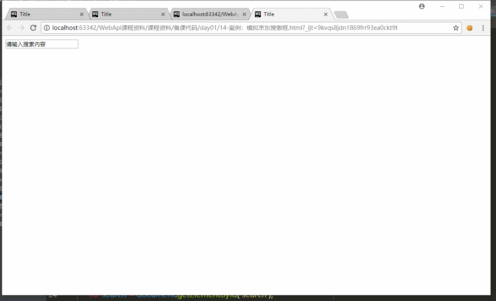
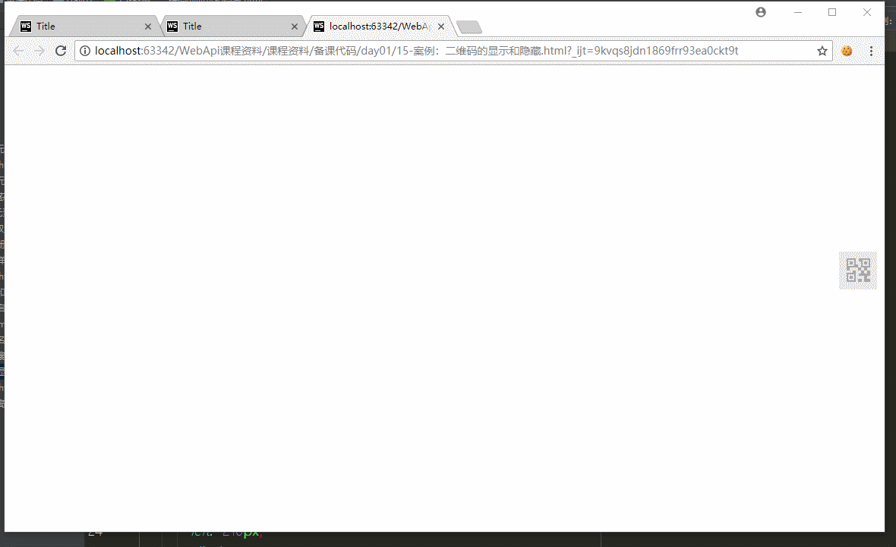
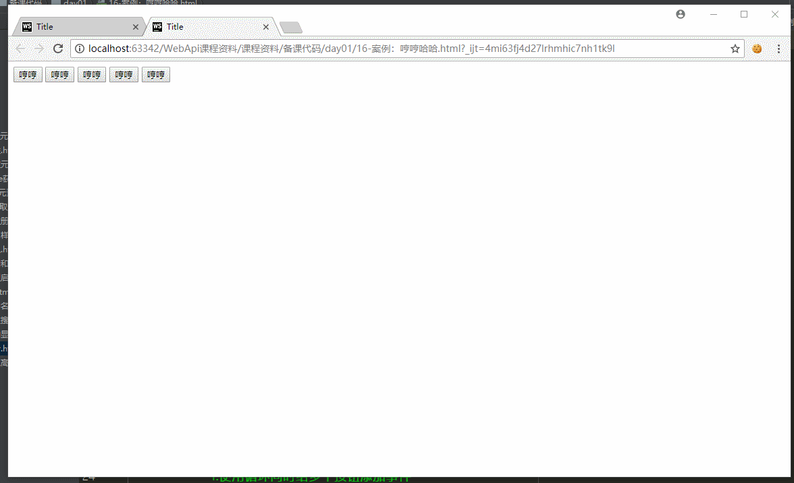
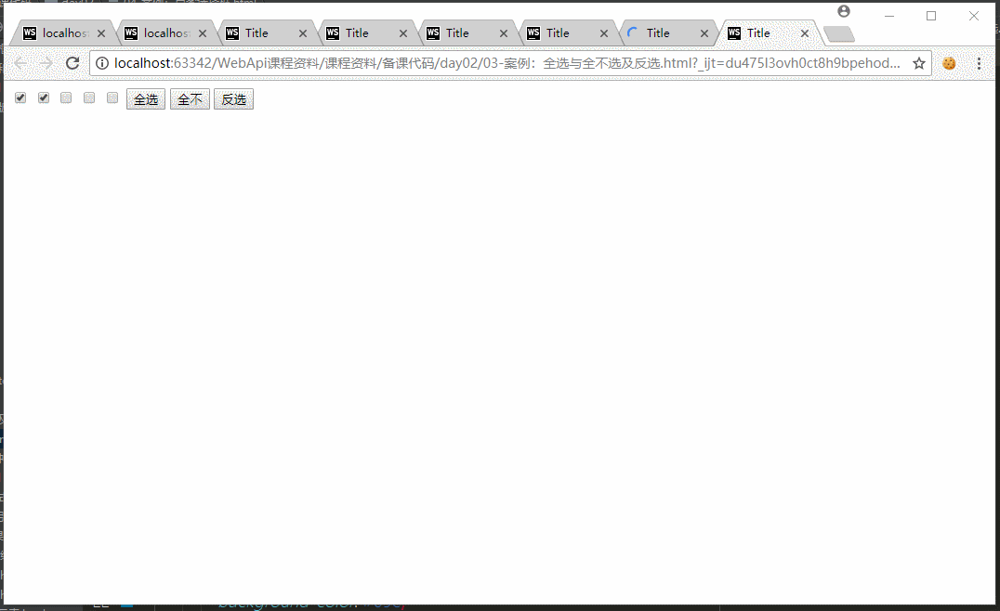
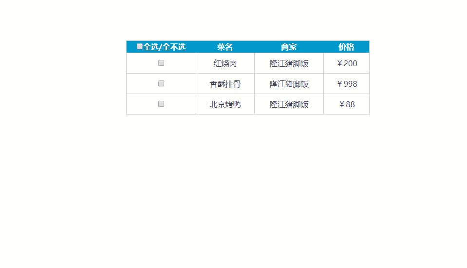
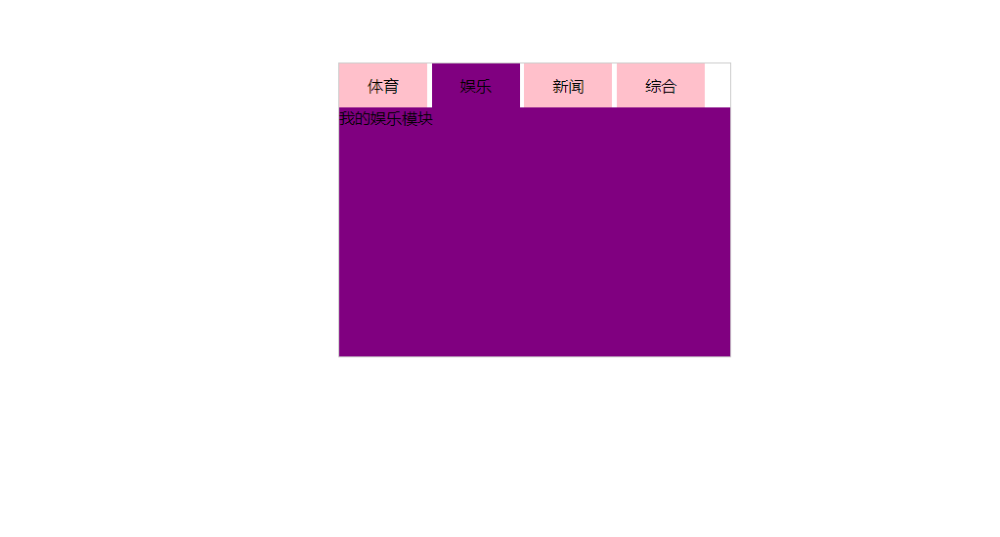

# 今日学习任务

* [ ] 1.经典案例
  * [ ] 用户登录：value
  * [ ] 模拟京东搜索框：焦点事件
  * [ ] 二维码显示与隐藏：鼠标移入移出事件
  * [ ] ==哼哼哈哈：排他思想==
  * [ ] ==点餐选择框：开关思想==
* [ ] 2.innerText与innerHTML
  * [ ] innertText与innerHTML区别
* [ ] 3.attribute操作自定义属性
  * [ ] a.语法
    * [ ] setAttribute()设置自定义属性	
    * [ ] getAttribute()获取自定义属性
    * [ ] removeAttribute()移除自定义属性
  * [ ] b.案例
    * [ ] 隔行变色高级版
    * [ ] 给按钮添加索引并显示
    * [ ] ==tab栏切换效果实现==

# 01-经典案例

## 1.1-登录判断用户名和密码

[效果预览](file:///C:/Users/张晓坤/Desktop/张晓坤前端备课资料/AB模式/03-WebApi/课程资料/备课代码/day02/01-案例：登录验证.htmll)


需求分析：点击登录按钮，判断用户名密码长度
            1.登录成功：用户名和密码长度都大于6
            2.登录失败：用户名或密码长度小于6
思路分析：事件三要素
                 1 获取元素：
                 2 注册事件：
                 3 事件处理：

```html
<!DOCTYPE html>
<html lang="en">
<head>
    <meta charset="UTF-8">
    <title>Title</title>
</head>
<body>
账号：<input type="text" id="userName" value="">
<br/><br/>
密码：<input type="password" id="password" >
<br/><br/>
<input type="button" value="登录" id="login" >

<script>
      /* 需求分析：点击登录按钮，判断用户名密码长度
            1.登录成功：用户名和密码长度都大于6
            2.登录失败：用户名或密码长度小于6
           思路分析：事件三要素
                 1 获取元素：
                 2 注册事件：
                 3 事件处理：
       */

      //1. 获取元素：
      var login = document.getElementById('login');//登录按钮
      var userName = document.getElementById('userName');//用户名
      var password = document.getElementById('password');//密码


      /*获取元素文本
      双标签：  innerText
      单标签：  value
       */

      console.log ( userName.innerText );//空字符串
      console.log ( userName.value );
      //2.注册事件：
      login.onclick = function (  ) {
          //3.事件处理：判断用户名和密码长度
          if (userName.value.length >= 6 && password.value.length >= 6){
              alert('登录成功');
          }else{
              alert('用户名或密码长度不够，登录失败');
          };
          // console.log ( userName.value );
      };
</script>
</body>

</html>
```


## 1.2-模拟京东搜索框

[效果预览](file:///C:/Users/张晓坤/Desktop/张晓坤前端备课资料/AB模式/03-WebApi/课程资料/备课代码/day02/02--案例：模拟京东搜索框.html)




需求分析：
          1,输入框成为焦点：  如果是默认文字，则情况
          2.输入框失去焦点：  如果没有输入，则显示默认文字

思路分析：事件三要素
                 1 获取元素：
                 2 注册事件：
                 3 事件处理：


表单输入框有两个特殊的事件（焦点事件）
   	成为焦点   onfocus : 出现光标，此时可以输入文字
   	失去焦点   onblur :   光标消失，此时不能输入文字


```html
<!DOCTYPE html>
<html lang="en">
<head>
    <meta charset="UTF-8">
    <title>Title</title>
</head>
<body>


<input type="text" value="请输入搜索内容" id="search">

<script>

      /* 需求分析：
          1,输入框成为焦点：  如果是默认文字，则情况
          2.输入框失去焦点：  如果没有输入，则显示默认文字

           思路分析：事件三要素
                 1 获取元素：
                 2 注册事件：
                 3 事件处理：
       */
    /*表单输入框有两个特殊的事件（焦点事件）
   成为焦点   onfocus : 出现光标，此时可以输入文字
   失去焦点   onblur :   光标消失，此时不能输入文字

     */

    //1.获取元素
    var search = document.getElementById('search');
    //2 注册事件

    //2.1 成为焦点
    search.onfocus = function (  ) {
        console.log ( "我出现光标了，此时可以输入文字" );

        if (this.value == '请输入搜索内容'){
            this.value = '';
        };
    };

    //2.2 失去焦点
    search.onblur = function (  ) {
        console.log ( "光标消失，我现在不能输入文字" );

        if (this.value.length == 0){
            this.value = '请输入搜索内容';
        };
    };
</script>
</body>
</html>
```


## 1.3-二维码显示和隐藏


[效果预览](file:///C:/Users/张晓坤/Desktop/张晓坤前端备课资料/AB模式/03-WebApi/课程资料/备课代码/day02/03-案例：二维码显示和隐藏.html)




需求分析：
            鼠标移入小盒子：显示大盒子，设置大盒子display属性为block
            鼠标移出小盒子：隐藏大盒子，设置大盒子display属性为none
思路分析：事件三要素
                 1 获取元素：
                 2 注册事件：
                 3 事件处理：


```html
<!DOCTYPE html>
<html>
<head lang="en">
    <meta charset="UTF-8">
    <title></title>

    <style>
        #small{

            width: 50px;
            height: 50px;
            background: url("images/bgs.png") no-repeat -159px -51px;

            position: fixed;
            top: 40%;
            right: 10px;
        }

        #big{

            width: 210px;
            height: 210px;
            position: absolute;
            left: -210px;
            display: none;
        }

        #big img{

            width: 100%;
            height: 100%;
        }
    </style>
</head>
<body>

<div id="small">

    <div id="big">
        
    </div>

</div>


<script>
      /* 需求分析：
            鼠标移入小盒子：显示大盒子，设置大盒子display属性为block
            鼠标移出小盒子：隐藏大盒子，设置大盒子display属性为none
           思路分析：事件三要素
                 1 获取元素：
                 2 注册事件：
                 3 事件处理：
       */

      //1. 获取元素：
      var small = document.getElementById('small');//小盒子
      var big = document.getElementById('big');//大盒子


      //2.注册事件：

      //2.1 鼠标移入小盒子
      small.onmouseover = function (  ) {
          //3.事件处理:显示大盒子
          big.style.display = 'block';
      };

      //2.2 鼠标移出小盒子
      small.onmouseout = function (  ) {
          //3.事件处理:隐藏大盒子
          big.style.display = 'none';
      };
</script>
</body>

</html>
```


## ==1.4-哼哼哈哈:排他思想==


[效果预览](file:///C:/Users/张晓坤/Desktop/张晓坤前端备课资料/全天模式/02-WebApi/课程资料/备课代码/day02/01-案例：哼哼哈哈.html)




```html
<!DOCTYPE html>
<html lang="en">
<head>
    <meta charset="UTF-8">
    <title>Title</title>
</head>
<body>

<input type="button" value="哼哼">
<input type="button" value="哼哼">
<input type="button" value="哼哼">
<input type="button" value="哼哼">
<input type="button" value="哼哼">

</body>

<script>
    /**案例需求：（1）点击任意一个按钮，改变按钮的文字和颜色
     *                  （2）一组按钮中只能有一个按钮是选中状态，其他按钮要回复原状
     *
     * 实际应用场景：比如美团购买餐厅套餐，主食三选一，凉菜六选一等
     *
     * 本小节知识点：
     *          * 1.使用循环同时给多个按钮添加事件
     *              * 由于这个事件响应函数并不是立马执行，而是用户点击之后才会执行，所以在函数体中获取循环变量i
     *        得到的永远都是数组的长度
     *          * 2.使用排他思想实现一组按钮只能选中某个的功能
     *              * 排他思想：遍历数组中所有元素，如果不是当前点击的这一个，则修改成默认颜色
     *
     */

    //1.获取所有的input标签元素
    var inputList = document.getElementsByTagName('input');
    //2.使用for循环给所有的input元素添加点击事件
    for(var i = 0;i<inputList.length;i++){

        inputList[i].onclick = function (  ) {
            //3.思考：如何在这个函数中获取到当前点击的那个按钮？

            //3.1  这样写会报错，因为i永远都是数组的长度，思考为什么？
           // inputList[i].style.background = 'hotpink';
            //3.2 使用this关键字：谁调用了这个方法，this就代表谁
            this.value = '哈哈';
            this.style.background = 'hotpink';
            //排他思想：遍历inputList数组中所有元素，如果不是当前点击的这一个，则修改成默认颜色
            for(var j = 0;j<inputList.length;j++){
                //遍历数组，只要不是当前点击的这一个元素就将属性设置成默认值
                if(inputList[j] != this){
                    inputList[j].value = '哼哼';
                    inputList[j].style.background = '';//设置为默认值
                }
            }
        };
    }
</script>
</html>
```


## 1.5-全选全不选及反选

[效果预览](<file:///C:/Users/%E5%BC%A0%E6%99%93%E5%9D%A4/Desktop/%E5%BC%A0%E6%99%93%E5%9D%A4%E5%89%8D%E7%AB%AF%E5%A4%87%E8%AF%BE%E8%B5%84%E6%96%99/%E5%85%A8%E5%A4%A9%E6%A8%A1%E5%BC%8F/02-WebApi/%E8%AF%BE%E7%A8%8B%E8%B5%84%E6%96%99/%E5%A4%87%E8%AF%BE%E4%BB%A3%E7%A0%81/day02/02-%E6%A1%88%E4%BE%8B%EF%BC%9A%E5%85%A8%E9%80%89%E4%B8%8E%E5%85%A8%E4%B8%8D%E9%80%89%E5%8F%8A%E5%8F%8D%E9%80%89.html>)




```html

<!DOCTYPE html>
<html lang="en">
<head>
    <meta charset="UTF-8">
    <title>Title</title>
</head>
<body>
<input class = 'check' type="checkbox" >
<input class = 'check' type="checkbox">
<input class = 'check' type="checkbox">
<input class = 'check' type="checkbox">
<input class = 'check' type="checkbox">

<input id="checkAll" type="button" value="全选">
<input id="unCheckAll" type="button" value="全不">
<input id="reverseCheck" type="button" value="反选">

<script>
      /* 需求分析：
            1.点击全选：设置选择框列表的checked值为true
            2.点击全不选：设置选择框列表的checked值为false
            3.点击反选：设置选择框列表的checked值与自身当前值相反
           思路分析：事件三要素
                 1 获取元素：
                 2 注册事件：
                 3 事件处理：
       */

      //1. 获取元素：
      var checkList = document.getElementsByClassName('check');//选择框列表
      var checkAll = document.getElementById('checkAll');//全选
      var unCheckAll = document.getElementById('unCheckAll');//全不选
      var reverseCheck = document.getElementById('reverseCheck');//反选
      //2.注册事件：

      //2.1 全选
      checkAll.onclick = function (  ) {
          //3.事件处理：设置选择框列表的checked值为true
          for(var i = 0;i<checkList.length;i++){
              checkList[i].checked = true;
          };
      };

      //2.2 全不选
      unCheckAll.onclick = function (  ) {
          //3.事件处理：设置选择框列表的checked值为false
          for(var i = 0;i<checkList.length;i++){
              checkList[i].checked = false;
          };
      }

      //2.3 全不选
      reverseCheck.onclick = function (  ) {
          //3.事件处理：设置选择框列表的checked值与自身当前值相反

          for(var i = 0;i<checkList.length;i++){
              console.log ( checkList[ i ].checked );
              checkList[i].checked = !checkList[i].checked;

              // checkList[i].checked =  checkList[i].checked?false:true;

              // if (checkList[i].checked == true){
              //     checkList[ i ].checked = false;
              // }else{//false
              //     checkList[ i ].checked = true;
              // }
          };
      }
</script>
</body>

</html>
```


## ==1.6-点餐选择框:开关思想==


[效果预览](file:///C:/Users/张晓坤/Desktop/张晓坤前端备课资料/全天模式/02-WebApi/课程资料/备课代码/day02/03-案例：点餐选择框.html)




需求分析：切入点：交互
        1.点击上方选择框：让下方选择框列表的checked值与自身保持一致
        2.点击下方选择框列表：判断上方选择框列表状态
            选中：所有的选择框checked值都是true
            未选中：只要有一个选择框checked值是false
  思路分析：事件三要素
             1 获取元素：
             2 注册事件：
             3 事件处理：

```html

<!DOCTYPE html>
<html>
<head lang="en">
    <meta charset="UTF-8">
    <title></title>
    <style>
        * {
            margin: 0;
            padding: 0;
        }

        table {
            border-collapse: collapse;
            border: 1px solid #c0c0c0;
            width: 500px;
            margin: 100px auto;
            text-align: center;
        }

        th {
            background-color: #09c;
            font: bold 16px "微软雅黑";
            color: #fff;
            height: 24px;
        }

        td {
            border: 1px solid #d0d0d0;
            color: #404060;
            padding: 10px;
        }
    </style>
</head>
<body>
<table>
    <tr>
        <th>
            <input type="checkbox" name="" id="checkAll"/>全选/全不选
        </th>
        <th>菜名</th>
        <th>商家</th>
        <th>价格</th>
    </tr>
    <tr>
        <td>
            <input type="checkbox" name="check"/>
        </td>
        <td>红烧肉</td>
        <td>隆江猪脚饭</td>
        <td>￥200</td>
    </tr>
    <tr>
        <td>
            <input type="checkbox" name="check"/>
        </td>
        <td>香酥排骨</td>
        <td>隆江猪脚饭</td>
        <td>￥998</td>
    </tr>
    <tr>
        <td>
            <input type="checkbox" name="check"/>
        </td>
        <td>北京烤鸭</td>
        <td>隆江猪脚饭</td>
        <td>￥88</td>
    </tr>


</table>

<script>
  /* 需求分析：切点
        1.点击上方选择框：让下方选择框列表的checked值与自身保持一致
        2.点击下方选择框列表：判断上方选择框列表状态
            选中：所有的选择框checked值都是true
            未选中：只要有一个选择框checked值是false
       思路分析：事件三要素
             1 获取元素：
             2 注册事件：
             3 事件处理：
   */

  //1. 获取元素：
  var checkAll = document.getElementById('checkAll');//全选/全不选
  var checkList = document.getElementsByName('check');//下方选择框列表
  //2.注册事件：

  //2.1 上方选择框点击事件
  checkAll.onclick = function (  ) {
      //3.事件处理:让下方选择框列表的checked值与自身保持一致
      console.log ( checkAll.checked );

      for(var i = 0;i<checkList.length;i++){
            checkList[i].checked = this.checked;
      }
  };

  //2.2 下方选择框列表点击事件

    for(var i = 0;i<checkList.length;i++){
        checkList[i].onclick = function (  ) {
            //3.事件处理:判断上方选择框列表状态

            /*开关思想：当某种操作结果只有两种状态。声明一个开关表示这两种状态isAllOk
            1.提出假设: var isAllOk = true
            2.验证假设
            3.根据开关状态实现需求
             */

            //3.1 声明开关，提出假设（本次点击之后所有的选择框都是选中）
            var isAllOk = true;
            //3.2 验证假设
            for(var j = 0;j<checkList.length;j++){
                console.log ( checkList[ j ].checked );
                if (checkList[j].checked == false){//假设被推翻
                    isAllOk = false;
                    break;
                };
            };

            //3.3 根据开关状态实现需求
            checkAll.checked = isAllOk;

            // if (isAllOk == true){
            //     checkAll.checked = true;
            // }else{
            //     checkAll.checked = false;
            // }
        };
    }
</script>
</body>

</html>
```


# 02-innerText与innerHTML

* 作用完全不同（只是有些类似）
  * 类似点：获取到的都是string类型字符串
  * innerText:获取元素文本
  * innerHTML:获取元素内容（文本+标签）

```html
<!DOCTYPE html>
<html lang="en">
<head>
    <meta charset="UTF-8">
    <title>Title</title>
</head>
<body>

<div id="box">我是班长
    <p>我是班长小迷妹</p>
</div>

<script>


    var box = document.getElementById('box');

    //1.innerText:获取元素文本（包含子标签的文本）
    console.log ( box.innerText );

    //2.innertHTML:获取元素内容(包含标签与文本)
    console.log ( box.innerHTML );

    //3.通过分别设置一个元素的innerText与innertHTML了解两者的区别

    //innerText:会把所有的内容都当成文本，无法解析标签
    // box.innerText = '<a>我是i连接</a><p>我是p</p>';

    //innerHTML:可以解析字符串中的标签
    //作用：可以和document.write()一样动态给页面添加元素
    box.innerHTML = '<a>我是i连接</a><p>我是p</p>';
</script>
</body>
</html>
```


# 03-attribute操作自定义属性

## 1.1-attribute操作自定义属性语法

* 标签元素属性:
  * (1)行内标准属性
  * （2）行内自定义属性
  * （3）js动态添加属性
  * （4）行外属性
* 1.attribute方式
  * 1.获取属性：getAttribute ( "aaa" )
    * 如果是类型直接使用calss，无需使用className，因为这种方式用的是字符串语法获取属性
  * 2.设置属性: 元素.setAttribute('属性名',属性值);
  * 3.删除属性： 元素.removeAttribute('属性名');
  * **用attribute方式设置的属性只能使用attribute方式来获取**
* 2.注意点
  * js点语法能获取到的属性：
    * （1）行内标准属性
    * （2）js点语法动态添加的自定义属性
  * 不能获取到的属性：
    * （1）行内自定义属性
    * (2)行外属性
  * getAttribute能获取到的属性：
    * （1）行内标准属性
    * （2）行内自定义属性
    * （3）setAttribute动态添加的属性
  * 不能获取到的属性：
    * （1）js点语法动态添加的自定义属性
    * （2）行外属性
* 3.总结：js点语法操作属性与attribute语法操作属性场景
  * 标准属性操作：使用js点语法（代码简洁）
  * 自定义属性操作：用attribute（易读性更高）


```html
<!DOCTYPE html>
<html lang="en">
<head>
    <meta charset="UTF-8">
    <title>Title</title>
    <style>
        .one{
            width: 100px;
            height: 100px;
            //background-color: red;
        }
    </style>
</head>
<body>

<!--如果一个属性不是html中得属性，那么这个属性成为自定义属性-->
<div id="div1" class="one" aaa='啊啊啊啊'></div>
</body>

<script src="common.js"></script>
<script>

    //元素属性写法： （1）行内标准属性   （2）行外属性  (3)js动态添加得属性  （4）行内自定义属性

    //1.js点语法属性操作

    //1.1 可以拿到哪些
 var div1 =  id('div1');
    div1.index = 1;
    div1.setAttribute('index',1);

 console.log ( div1.className );//行内标准属性
    div1.a = 'a';
    console.log ( div1.a )//js动态添加得属性

    //1.2 不可以拿到
 console.log ( div1.style.width );//行外属性
   console.log ( div1.aaa );//行内自定义属性

    //2. attribute方式

    /*获取属性：  元素.getAttribute('属性名')
    添加属性：元素.setAttribute('属性名',属性值);
        * 用setAttribute方式添加只能用getAttribute获取
     删除属性： 元素.removeAttribute('属性名');
        * a.属性名属性值全部删除，更加彻底
        * b.点语法只能删除属性值，不能删除属性名


    总结：js点语法操作属性与attribute语法操作属性场景
    标准属性：点语法（简洁）
    自定义属性：attribute（代码易读性更高）

     */

    //2.1 可以获取
    console.log ( div1.getAttribute ( "class" ) );//行内标准属性   类名直接class即可
    console.log ( div1.getAttribute ( "aaa" ) );//行内自定义属性

    //2.2 不可以获取
    console.log ( div1.getAttribute ( "style.width" ) );//行外属性
    console.log ( div1.getAttribute ( "a" ) );//js点语法动态添加得属性

    //添加属性
    div1.setAttribute('index',10);
    console.log ( div1.getAttribute ( "index" ) )//取值   用setAttribute方式添加只能用getAttribute获取
    console.log ( div1.index );


    //3.删除属性
    //div1.className = '';//属性得值没有了，属性名还在
    div1.removeAttribute('class');//属性名和属性值全部删除，更加干净彻底

</script>
</html>
```


## 1.2-案例：隔行变色高级版

[效果预览](file:///C:/Users/张晓坤/Desktop/张晓坤前端备课资料/全天模式/02-WebApi/课程资料/备课代码/day03/02-案例：隔行变色高级版.html)


* 需求： *（1）单数行显示黄色 双数行显示绿色* （2）鼠标移入哪一个就显示红色高亮，移开就恢复原状
* 思路分析：
  * 1.先获取到界面所有的li标签
  * 2.遍历数组，实现li标签的隔行变色
  * 3.给每一个li标签注册鼠标移入和移出事件
  * 4.移入则修改颜色为红色
    * 对象的赋值操作先回收旧值，再赋新值
  * 5.移出则修改颜色为原先的颜色
    * 可以给对象动态添加一个属性用于存储原先的颜色

```html
<!DOCTYPE html>
<html lang="en">
<head>
    <meta charset="UTF-8">
    <title>Title</title>
</head>
<body>

<ul id="ul1">
    <li>隔壁老王1</li>
    <li>隔壁老王2</li>
    <li>隔壁老王3</li>
    <li>隔壁老王4</li>
    <li>隔壁老王5</li>
    <li>隔壁老王6</li>
    <li>隔壁老王7</li>
    <li>隔壁老王8</li>
    <li>隔壁老王9</li>
    <li>隔壁老王10</li>
</ul>
</body>

<script>
    /*需求：（1）单数行显示黄色  双数行显示绿色  （2）鼠标移入哪一个就显示红色高亮，移开就恢复原状
    思路分析：
        * 1.先获取到界面所以的li标签
        * 2.遍历数组，实现li标签的隔行变色
        * 3.给每一个li标签注册鼠标移入和移出事件
        * 4.移入则修改颜色为红色
        * 5.移出则修改颜色为原先的颜色
     */

    //1.获取li标签列表
    var liList = document.getElementsByTagName('li');
    //2.遍历数组，实现隔行变色
    for(var i = 0;i<liList.length;i++){
        if(i%2 == 0){
            //双数行显示绿色
            liList[i].style.background = 'green';
        }else{
            //单数行显示黄色
            liList[i].style.background = 'yellow';
        }

        //3.1 给每一个li标签注册鼠标移入和移出事件
        liList[i].onmouseover = function (  ) {

            /*（1） 修改之前我们给这个元素添加一个属性用于存储当前颜色*/
            this.setAttribute('defaultColor',this.style.background);

            //（2）如果移入则修改颜色为红色高亮
            this.style.background = 'red';

        }

        //3.2 移出
        liList[i].onmouseout = function (  ) {
            //如果移出则修改颜色为之前的颜色
            this.style.background = this.getAttribute('defaultColor');
        }
    }
</script>
</html>
```

## 1.3-练习：给按钮添加索引并点击显示

[效果预览](<file:///C:/Users/%E5%BC%A0%E6%99%93%E5%9D%A4/Desktop/%E5%BC%A0%E6%99%93%E5%9D%A4%E5%89%8D%E7%AB%AF%E5%A4%87%E8%AF%BE%E8%B5%84%E6%96%99/%E5%85%A8%E5%A4%A9%E6%A8%A1%E5%BC%8F/02-WebApi/%E8%AF%BE%E7%A8%8B%E8%B5%84%E6%96%99/%E5%A4%87%E8%AF%BE%E4%BB%A3%E7%A0%81/day03/02-%E7%BB%83%E4%B9%A0%EF%BC%9A%E7%BB%99%E6%8C%89%E9%92%AE%E6%B7%BB%E5%8A%A0%E7%B4%A2%E5%BC%95%E5%B9%B6%E6%98%BE%E7%A4%BA.html>)


```html
<!DOCTYPE html>
<html lang="en">
<head>
    <meta charset="UTF-8">
    <title>Title</title>
</head>
<body>

<input type="button" value="按钮1">
<input type="button" value="按钮2">
<input type="button" value="按钮3">
<input type="button" value="按钮4">
<input type="button" value="按钮5">
</body>

<script>
    /*需求：给每一个按钮添加一个自定义属性表示按钮的索引，点击按钮弹出自己的索引
     */

    //1.获取所有按钮
    var buttonList = document.getElementsByTagName('input');
    //2.循环数组给每一个按钮添加自定义属性
    for(var i = 0;i<buttonList.length;i++){
        buttonList[i].setAttribute('index',i);

        buttonList[i].onclick = function (  ) {
            alert(this.getAttribute('index'));
        }
    }
</script>
</html>
```


## ==1.4-案例：tab栏切换==


[效果预览](file:///C:/Users/张晓坤/Desktop/张晓坤前端备课资料/全天模式/02-WebApi/课程资料/备课代码/day03/03-案例：tab栏切换效果实现.html)

* 需求：点击上面tab栏按钮：
  * （1）按钮的颜色变成粉色
  * （2）下方显示对应的大盒子内容
* 核心思路：
  * （1）点击按钮时设置自身的类为current ，设置对应大盒子的display属性为block
    * 如何保证上面按钮与下方大盒子对应：给按钮添加index属性
  * （2）使用排他思想去除其他按钮的类和其他大盒子的display属性为none

```html
<!DOCTYPE html>
<html>
<head lang="en">
    <meta charset="UTF-8">
    <title>tab栏切换</title>
    <style>
        .Box {
            width: 240px;
            border: 1px solid #000;
            margin: 100px auto;
            padding: 20px;
        }

        .con {
            width: 100%;
            height: 200px;
            background-color: #cccccc;
            border: 1px solid #000;
            margin-top: 10px;
            display: none;
        }

        .current {
            background-color: pink;
        }
    </style>
</head>
<body>
<div class="Box" id="box">
    <button class="current">按钮1</button>
    <button>按钮2</button>
    <button>按钮3</button>
    <button>按钮4</button>
    <div class="con" style="display:block">内容1</div>
    <div class="con">内容2</div>
    <div class="con">内容3</div>
    <div class="con">内容4</div>
</div>

</body>

<script>
    /*需求：点击上面tab栏按钮：（1）按钮的颜色变成粉色  （2）下方显示对应的大盒子内容

    核心思路：（1）点击按钮时设置自身的类为current ，设置对应大盒子的display属性为block
                    * 如何保证上面按钮与下方大盒子对应：给按钮添加index属性
    （2）使用排他思想去除其他按钮的类和其他大盒子的display属性为none
     */

    //1.获取元素
    var buttonList = document.getElementsByTagName('button');
    var divList = document.getElementsByClassName('con');

    //2.给所有按钮添加点击事件
    for(var i = 0;i<buttonList.length;i++){
        //给每一个按钮添加一个index属性标记顺序
        buttonList[i].setAttribute('index',i);

        buttonList[i].onclick = function (  ) {
            //3.点击按钮时，要做哪些事？  自身颜色变化，下方大盒子显示内容变化，排他思想去掉其他按钮样式
            //3.1 自身颜色变化
            this.setAttribute('class','current');
            //3.2 下方大盒子显示内容变化
            var index = this.getAttribute('index');//先获取本次点击按钮的下标
            divList[index].style.display = 'block';

            //3.3 排他思想 改变其他按钮的颜色 和其他大盒子的display属性
            for(var j = 0;j<buttonList.length;j++){
                if(buttonList[j] != this){//排他：如果不是自己（本次点击的这个按钮）
                    buttonList[j].removeAttribute('class');//移除class
                    divList[j].style.display = 'none';//对应大盒子隐藏
                }
            }
        }
    }
</script>
</html>
```


# 04-今日学习总结

* 1.巧用this关键字
  * 事件处理函数并不会马上被触发，如果使用for循环给多个元素添加事件，千万不要使用循环变量来获取事件源
  * this关键字：谁触发了这个方法，this就代表谁
* 2.排他思想
  * 循环遍历元素数组，只要不是自己就设置属性为默认值（排他）
* 3.开关思想
  * 应用场景：某种操作的结果只有两种情况（声明布尔类型变量存储这两种情况true和false）
  * 步骤
    * 1.提出假设（变量声明默认值）
    * 2.验证假设
    * 3.根据·开关结果实现需求

# 05-课后练习





