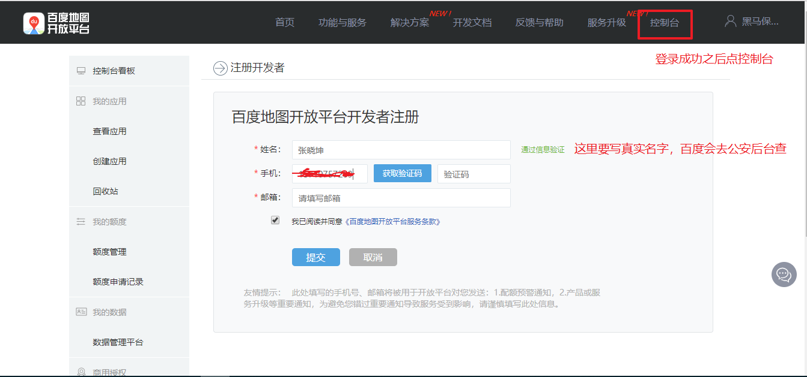

# 今日学习任务

* [ ] 1.BOM:浏览器对象模型(笔记)
  * [ ] window对象：浏览器窗口
  * [ ] location对象：地址栏
  * [ ] history对象：网页历史记录
  * [ ] navigator对象：浏览器信息
  * [ ] screen对象：电脑屏幕信息
* [ ] 2.localStorage与sessionStorage
  * [ ] localstorge与sessioStorge的区别
  * [ ] ==sessionStorage案例：页面间传值==
* [ ] 3.经纬度与地图

# 01-BOM浏览器对象模型

## 1.1-BOM与DOM介绍

* JavaScript语言由三部分组成

  * ECMAJavaScript：定义了js的语法规范

  * Dom：document object model文档对象模型：一个HTML文档中所有的一切都是dom对象

    ```
      * Dom定义了一套操作HTML文档的API（节点的增删改查）
    ```

  * Bom：Brower object model浏览器对象模型 例如：一个浏览器的窗口就是一个window对象

    ```
      * Bom定义了一套操作浏览器窗口的API
    ```

* Bom主要由五大对象组成：

  * window:浏览器核心对象
  * location：包含当前页面的URL信息
  * history：history对象主要用于记录你当前窗口的历史记录
  * navigator：包含当前浏览器的信息，例如用的什么浏览器，操作系统版本等
  * screen：获取用户电脑的屏幕分辨率
    * 这个一般不用，因为对开发者没啥作用


## 1.2-window对象

* 1.window对象：指的是当前浏览器窗口，它是JS中的顶级对象
  * (1).所有的全局变量都是window对象的属性：最顶级的对象
    * document对象
    * bom对象
    * 全局的方法：alert(),setInterval()...........
  * (2).只要是window的属性和方法，在使用的时候都可以省略window
    * 例如：window.alert() 可以省略window写成alert()
    * 例如：window.document 可以省略window写成document
  * (3).window对象有一个特殊属性叫做name
    * 它永远都是一个字符串，无论给他赋什么值
* 2.window对象有两个常用的方法：open()与close()
  * open():打开一个窗口
  * close():关闭一个窗口


```html
<!DOCTYPE html>
<html lang="en">
<head>
    <meta charset="UTF-8">
    <title>Title</title>
</head>
<body>

<input type="button" value="点我打开一个新窗口" id="open">
<input type="button" value="点我有惊喜" id="close">

</body>

<script>
    /*1.window对象：指的是当前浏览器窗口，它是JS中的顶级对象
        * (1).所有的全局变量都是window对象的属性：最顶级的对象
            * document对象
            * bom对象
            * 全局的方法：alert(),setInterval()...........
         * (2).只要是window的属性和方法，在使用的时候都可以省略window
            * 例如：window.alert()  可以省略window写成alert()
            * 例如：window.document 可以省略window写成document
         * (3).window对象有一个特殊属性叫做name
            * 它永远都是一个字符串，无论给他赋什么值
            *
       2.window对象有两个常用的方法：open()与close()
            * open():打开一个窗口
            * close():关闭一个窗口

     */

    //1.window是顶级对象，所有的全局变量都是window对象的属性
    var age = 18;
    console.log ( window.age );

    //2.只要是window对象的属性和方法，window可以省略
    console.log ( window.document === document );true

    //3.window有一个特殊的属性叫做name，它永远都是一个字符串
    console.log ( window.name );//默认是一个空字符串
    window.name = 123456;
    console.log ( name );//永远都是一个字符串
    //就算你重新声明一个变量叫做name，也无法覆盖它
    var name = [123];
    console.log ( name );

    //打开新窗口
    document.getElementById('open').onclick = function (  ) {
        /**
        * @param 第一个参数：URL  要打开的窗口网址
         * @param 第二个参数：类似于a标签的target属性，是替换当前窗口还是新开一个窗口
         * @param 第三个参数：新窗口特征：大小和位置等(新窗口才有效_blank)
         * @param 第四个参数：布尔类型  true/false:把新开的窗口加入/不加入到浏览器历史记录
         * @return 新打开的window对象
        */
       var newWindow = window.open('https://www.baidu.com', '_blank', 'top=100,left=100,width=500,height=300', true );
    }

    //关闭窗口
    document.getElementById('close').onclick = function (  ) {
        //参数就是你想要关闭的窗口对象，如果不写，默认就是关闭自己
        //1.这样写如果关闭的是顶级窗口谷歌和火狐会失效，如果失效可以使用下面这种写法
        //window.close( );

        /*2.谷歌火狐为了安全起见会拦截我们的代码，js代码只能关闭用js代码打开的界面，
        所以我们用js先假装在当前窗口打开自己，然后再关闭自己*/
        //这里的url不是空字符串""，而是一个空格字符串  " "
        window.open(" ","_self").close();
    }
</script>
</html>
```


## 1.3-window对象三个事件

window对象有三个事件，记录了浏览器窗口从打开到关闭的三个过程

* 1.window.onload:界面上所有的内容加载完毕之后才触发这个事件
* 2.window.onbeforeunload:界面在关闭之前会触发这个事件
* 3.window.onunload:界面在关闭的那一瞬间会触发这个事件


```html
<!DOCTYPE html>
<html lang="en">
<head>
    <meta charset="UTF-8">
    <title>Title</title>
</head>

<script>
    /*window对象有三个事件，记录了浏览器窗口从打开到关闭的三个过程

    1.window.onload:界面上所有的内容加载完毕之后才触发这个事件

    2.window.onbeforeunload:界面在关闭之前会触发这个事件

        3.window.onunload:界面在关闭的那一瞬间会触发这个事件

     */

    //由于我们script标签写在了body标签的上面，这行代码会在body内容还未加载的时候就执行
    console.log ( document.getElementById ( "p1" ) );//null  此时编译器还未解析p标签

    //1.window.onload：界面上所有内容加载完毕后会触发
    window.onload = function ( ) {

        // 由于编译器是从上往下解析html文件的，如果我们的js代码写在body前面，就有可能无法获取dom对象
        console.log ( "当前界面全部加载完毕" );
        //window.onload无论写在界面什么位置都是等整个界面加载完毕之后才会执行
        console.log ( document.getElementById ( "p1" ) );
    }

    //2.window.onbeforeunload:界面在关闭前触发
    window.onbeforeunload = function (  ) {
        /*  1.这个方法主要用于在界面关闭之前保存一些重要数据
        *  2.也可以弹出一个提示框挽留一下用户
        * */

        //return 内容：浏览器会自动弹出一个挽留窗口
        //谷歌和火狐都会拦截这种恶心事，只有IE支持
        return '你真的要狠心抛弃我吗';
    }

    //3 window.onunload:界面关闭时触发
    window.onunload = function (  ) {

        console.log('界面正在关闭');

    }
</script>

<body>

<p id="p1">我是p标签</p>
</body>


</html>
```


## 1.4-location对象

* 1.location对象：包含当前页面的URL信息
  * url：全球统一资源定位符
  * url = 协议名（http） + ip地址（域名） + 端口号 + 资源路径
  * 暂时只需要知道location对象包含一个网页的网络url信息即可，具体的含义将在后面阶段学习网络的时候详细讲解
* 2.location对象有三个常用的方法
  * （1）打开新网页：location.assign('你要打开的新网页的url')
  * （2）替换当前网页：location.replace('要替换的网页url')
  * (3) 刷新当前网页: location.reload()

```html
<!DOCTYPE html>
<html lang="en">
<head>
    <meta charset="UTF-8">
    <title>Title</title>
</head>
<body>

<input type="button" id="assign" value="assign打开新网页">
<br>
<input type="button" id="replace" value="replace替换当前网页">
<br>
<input type="button" id="reload" value="reload刷新当前网页">
<br>

</body>

<script>
    /*1.location对象：包含当前页面的URL信息
        * url：全球统一资源定位符
        * url = 协议名（http） + ip地址（域名） + 端口号 + 资源路径
        * 暂时只需要知道location对象包含一个网页的网络url信息即可，具体的含义将在后面阶段学习网络的时候详细讲解

      2.location对象有三个常用的方法
            * （1）打开新网页：location.assign('你要打开的新网页的url')
            * （2）替换当前网页：location.replace('要替换的网页url')
            *   (3)  刷新当前网页: location.reload()
     */

    //1.location对象信息查看
    console.log ( window.location );//location对象
    console.log(location.hash);//资源定位符（锚点定位）
    console.log(location.host);//主机   host = hostname + port
    console.log(location.hostname);//主机名（ip地址）
    console.log(location.port);//端口号
    console.log(location.href);//完整的url路径
    console.log(location.pathname);//资源路径
    console.log(location.protocol);//url的协议
    console.log(location.search);//url请求的参数

    //2.assign：打开新网页
    document.getElementById('assign').onclick = function (  ) {
        //会留下历史记录（可以回退）
        window.location.assign('http://www.itheima.com');
        //上面这行代码等价于下面这行代码
        //window.location.href = 'http://www.itheima.com';
    }

    //3.replace:替换当前网页
    document.getElementById('replace').onclick = function (  ) {
        //不会留下历史记录（不能回退）
        window.location.replace('http://www.itcast.com');
    }

    //4.刷新当前网页
    document.getElementById('reload').onclick = function (  ) {
        //相当于按了F5刷新当前网页
        window.location.reload();
    }

</script>
</html>
```


## 1.5-history对象

history对象主要用于记录你当前窗口的历史记录

* 主要作用就是前进和后退网页（相当于浏览器的左上角前进后退按钮功能）
* history.forward():前进
* history.back():后退


```html
<!DOCTYPE html>
<html lang="en">
<head>
    <meta charset="UTF-8">
    <title>Title</title>
</head>
<body>
<a href="09-history测试页.html">点我跳转</a>
<input type="button" value="前进" id="forword">
</body>

<script>
    /*history对象主要用于记录你当前窗口的历史记录
        * 主要作用就是前进和后退网页（相当于浏览器的左上角前进后退按钮功能）
        * history.forward():前进
        * history.back():后退
     */

    document.getElementById('forword').onclick = function (  ) {
        //跳转到当前网页历史记录的下一页，如果没有下一页的历史记录，则不跳转
        history.forward();
    }
</script>
</html>
```


## 1.6-navigator对象

navigator对象：包含当前浏览器的信息

* 工作中应用场景：用户信息统计（统计我这个网站平台的用户群体分布，什么浏览器，windows什么版本等）


```html
<!DOCTYPE html>
<html lang="en">
<head>
    <meta charset="UTF-8">
    <title>Title</title>
</head>
<body>

</body>

<script>
    /*navigator对象：包含当前浏览器的信息
        工作中应用场景：用户信息统计（统计我这个网站平台的用户群体分布，什么浏览器，windows什么版本等）

     */

    console.log ( navigator );//navigator对象
    console.log ( navigator.appVersion );//当前浏览器版本信息
    console.log ( navigator.platform );//当前浏览器的硬件平台
    console.log ( navigator.userAgent );//当前浏览器信息

    //使用场景1：判断当前用户的操作系统是32位还是64位
    //谷歌和IE  64位显示WOW64    火狐显示Win64
    if(navigator.userAgent.indexOf('WOW64') != -1 || navigator.userAgent.indexOf('Win64') != -1){
        console.log ( "64位" );
    }else{
        console.log ( "32位" );
    }

    //使用场景2：判断用户当前使用哪种浏览器
    if(navigator.userAgent.indexOf('Chrome') != -1){
        console.log ( "谷歌浏览器" );
    }else if(navigator.userAgent.indexOf('Firefox') != -1){
        console.log ( "火狐浏览器" );
    }else{
        console.log ( "IE浏览器" );//也有可能是其他小众浏览器，可以忽略不计
    }

</script>
</html>
```


# ==02-localstorage与sessionstorage==


## 1.1-localstorage

1.localStorage:本地存储

​                将数据存储到浏览器

2.语法

​                存：  localStorage.setItem('属性名','属性值')

​                取：  localStorage.getItem('属性名')

​                删：  localStorage.removeItem('属性名')

​                清空： localStorage.clear()

3.注意点

​                a.存储的数据只能是字符串类型。如果是其他数据类型则会自动调用toString()方法转成字符串

​                b.永久存储。除非自己删，否则一直存在于浏览器


```html
<!DOCTYPE html>
<html lang="en">
<head>
    <meta charset="UTF-8">
    <meta name="viewport" content="width=device-width, initial-scale=1.0">
    <meta http-equiv="X-UA-Compatible" content="ie=edge">
    <title>Document</title>
</head>
<body>
    <button id="btn1">存储据</button>
    <button id="btn2">取储据</button>
    <button id="btn3">删储据</button>
    <button id="btn4">清空储据</button>

    <script>
        /* 
            1.localStorage:本地存储
                将数据存储到浏览器

            2.语法
                存：  localStorage.setItem('属性名','属性值')
                取：  localStorage.getItem('属性名')
                删：  localStorage.removeItem('属性名')
                清空： localStorage.clear()

            3.注意点
                a.存储的数据只能是字符串类型。如果是其他数据类型则会自动调用toString()方法转成字符串
                b.永久存储。除非自己删，否则一直存在于浏览器
         */


        //存
        document.getElementById('btn1').onclick = function(){
            localStorage.setItem('name','班长');
            localStorage.setItem('age',18);
            localStorage.setItem('girlFriend',['苍老师','波多老师','吉泽老师']);
        }

        //取
        document.getElementById('btn2').onclick = function(){
            var age = localStorage.getItem('age');
            console.log(age); 
        }

        //删
        document.getElementById('btn3').onclick = function(){
            localStorage.removeItem('girlFriend'); 
        }

        //清空:一次性删除所有数据
        document.getElementById('btn4').onclick = function(){
            localStorage.clear(); 
        }
    </script>
</body>
</html>
```


## 1.2-sessionStorage

1.sessionStorage相当于短命版的localStorage，其他用法完全一致

2.两者区别：HP值不同

​                localStorage：永久存储（存在硬盘，HP值无限）

​                sessionStorage：临时存储（存在内存，HP值一条命，只要浏览器关闭就没有了）


```html
<!DOCTYPE html>
<html lang="en">
<head>
    <meta charset="UTF-8">
    <meta name="viewport" content="width=device-width, initial-scale=1.0">
    <meta http-equiv="X-UA-Compatible" content="ie=edge">
    <title>Document</title>
</head>
<body>
    <button id="btn1">存储据</button>
    <button id="btn2">取储据</button>
    <button id="btn3">删储据</button>
    <button id="btn4">清空储据</button>

    <script>
        /* 
            1.sessionStorage相当于短命版的localStorage，其他用法完全一致

            2.两者区别：HP值不同
                localStorage：永久存储（存在硬盘，HP值无限）
                sessionStorage：临时存储（存在内存，HP值一条命，只要浏览器关闭就没有了）

         */


        //存
        document.getElementById('btn1').onclick = function(){
            sessionStorage.setItem('name','班长');
            sessionStorage.setItem('age',18);
            sessionStorage.setItem('girlFriend',['苍老师','波多老师','吉泽老师']);
        }

        //取
        document.getElementById('btn2').onclick = function(){
            var age = sessionStorage.getItem('age');
            console.log(age); 
        }

        //删
        document.getElementById('btn3').onclick = function(){
            sessionStorage.removeItem('girlFriend'); 
        }

        //清空:一次性删除所有数据
        document.getElementById('btn4').onclick = function(){
            sessionStorage.clear(); 
        }
    </script>
</body>
</html>
```


## ==1.3-案例：页面间传值==

[效果预览](file:///C:/Users/%E5%BC%A0%E6%99%93%E5%9D%A4/Desktop/%E5%BC%A0%E6%99%93%E5%9D%A4%E5%89%8D%E7%AB%AF%E5%A4%87%E8%AF%BE%E8%B5%84%E6%96%99/AB%E6%A8%A1%E5%BC%8F/03-WebApi/%E8%AF%BE%E7%A8%8B%E8%B5%84%E6%96%99/%E5%A4%87%E8%AF%BE%E4%BB%A3%E7%A0%81/day04/09-%E6%A1%88%E4%BE%8B%EF%BC%9A%E9%A1%B5%E9%9D%A2%E9%97%B4%E4%BC%A0%E5%80%BC1.html)

* 页面a

```html
<!DOCTYPE html>
<html lang="en">
<head>
    <meta charset="UTF-8">
    <meta name="viewport" content="width=device-width, initial-scale=1.0">
    <meta http-equiv="X-UA-Compatible" content="ie=edge">
    <title>Document</title>
</head>
<body>
    <input type="text" placeholder="请输入账号" id="user">
    <input type="password" placeholder="请输入密码" id="pwd">
    <a href="09-页面间传值2.html" id="next">下一步</a>

    <script>

        var user = document.getElementById('user');
        var pwd = document.getElementById('pwd');

        document.getElementById('next').onclick = function(){
            //希望跳转之前保存一下数据
            sessionStorage.setItem('user',user.value);
            sessionStorage.setItem('pwd',pwd.value);
        }
    </script>
</body>
</html>
```

* 页面b

```html
<!DOCTYPE html>
<html lang="en">

<head>
    <meta charset="UTF-8">
    <meta name="viewport" content="width=device-width, initial-scale=1.0">
    <meta http-equiv="X-UA-Compatible" content="ie=edge">
    <title>Document</title>
</head>

<body>
    <input type="text" placeholder="请输入职业" id="job">
    <input type="text" placeholder="请输入邮箱" id="email">
    <input type="text" placeholder="请输入地址" id="addr">

    <input type="button" value="注册" id="register">

    <script>

        var job = document.getElementById('job');
        var email = document.getElementById('email');
        var addr = document.getElementById('addr');

        document.getElementById('register').onclick = function () {

            //拿到上一个页面的内容
            var user = sessionStorage.getItem('user');
            var pwd = sessionStorage.getItem('pwd');
            //拿到当前页面的内容

            //一起发给服务器
            console.log(user, pwd, job.value, email.value, addr.value);

        }
    </script>
</body>

</html>
```


# 03-经纬度与地图(了解即可)

## 1.1-navigator获取经纬度（了解即可）


```html
<!DOCTYPE html>
<html lang="en">

<head>
    <meta charset="UTF-8">
    <meta name="viewport" content="width=device-width, initial-scale=1.0">
    <meta http-equiv="X-UA-Compatible" content="ie=edge">
    <title>Document</title>
</head>

<body>

    <script>
        /* 
            1.获取经纬度：其实就是获取当前设备的地理位置
            2.谷歌浏览器无法获取
                谷歌支持这个功能，但是我们电脑不是GPS定位而是通过服务器ip地址查询位置
                而谷歌的服务器ip地址在国内被和谐了
         */
        navigator.geolocation.getCurrentPosition(function (location) {
            console.log(location);
            // 获取经度
            console.log(location.coords.longitude);
            // 获取纬度
            console.log(location.coords.latitude);

        });
    </script>
</body>

</html>
```


## 1.2-百度地图基本使用流程（了解即可）

* 1.进官网:<http://lbsyun.baidu.com/>
* 2.查文档:<http://lbsyun.baidu.com/jsdemo.htm#a1_2>
* 3.复制粘贴代码
  * 由于百度地图需要实名授权认证，所以在使用之前一定要登录百度账号申请授权。


* 1.登录/注册，进行实名认证:<http://lbsyun.baidu.com/apiconsole/center>




* 2.复制粘贴代码使用
  * 把默认的北京市改成深圳市，然后把默认的北京市经纬度改成上一小节获取的经纬度就会显示深圳地图啦

```html
<!DOCTYPE html>
<html>
<head>
	<meta http-equiv="Content-Type" content="text/html; charset=utf-8" />
	<meta name="viewport" content="initial-scale=1.0, user-scalable=no" />
	<style type="text/css">
	body, html,#allmap {width: 100%;height: 100%;overflow: hidden;margin:0;font-family:"微软雅黑";}
	</style>
	<script type="text/javascript" src="http://api.map.baidu.com/api?v=2.0&ak=Rh7oHvjHXOatI8XZSsyUl4BefBQs4y2K"></script>
	<title>地图展示</title>
</head>
<body>
	<div id="allmap"></div>
</body>
</html>
<script type="text/javascript">
	// 百度地图API功能
	var map = new BMap.Map("allmap");    // 创建Map实例
	map.centerAndZoom(new BMap.Point(113.91919183378965, 22.57667526927627), 11);  // 初始化地图,设置中心点坐标和地图级别
	//添加地图类型控件
	map.addControl(new BMap.MapTypeControl({
		mapTypes:[
            BMAP_NORMAL_MAP,
            BMAP_HYBRID_MAP
        ]}));	  
	map.setCurrentCity("深圳");          // 设置地图显示的城市 此项是必须设置的
	map.enableScrollWheelZoom(true);     //开启鼠标滚轮缩放
</script>
```


## 1.3-百度地图显示坐标点

* 官网复制粘贴代码：<http://lbsyun.baidu.com/jsdemo.htm#c1_2>

```html
<!DOCTYPE html>
<html>
<head>
	<meta http-equiv="Content-Type" content="text/html; charset=utf-8" />
	<meta name="viewport" content="initial-scale=1.0, user-scalable=no" />
	<style type="text/css">
	body, html,#allmap {width: 100%;height: 100%;overflow: hidden;margin:0;font-family:"微软雅黑";}
	</style>
	<script type="text/javascript" src="http://api.map.baidu.com/api?v=2.0&ak=Rh7oHvjHXOatI8XZSsyUl4BefBQs4y2K"></script>
	<title>添加动画标注点</title>
</head>
<body>
	<div id="allmap"></div>
</body>
</html>
<script type="text/javascript">
	// 百度地图API功能
	var map = new BMap.Map("allmap");
	var point = new BMap.Point(113.91919183378965, 22.57667526927627);
	map.centerAndZoom(point, 15);
	var marker = new BMap.Marker(point);  // 创建标注
	map.addOverlay(marker);               // 将标注添加到地图中
	marker.setAnimation(BMAP_ANIMATION_BOUNCE); //跳动的动画
</script>

```


# 04-今日学习总结


* bom对象

* 1，windows对象

  * 指的是当前浏览器窗口，它是JS中的顶级对象
  * 1.特点
    * (1).所有的全局变量都是window对象的属性：最顶级的对象
    * (2).只要是window的属性和方法，在使用的时候都可以省略window
      * window.alert() 可以省略window写成alert()
      * window.document 可以省略window写成document
    * (3).window对象有一个特殊属性叫做name，它永远都是一个字符串，无论给他赋什么值
  * 2.两个常用方法
    * open()：打开一个新窗口
      * `window.open('https://www.baidu.com', '_blank', 'top=100,left=100,width=500,height=300', true );`
    * close()：关闭一个窗口
      * `window.close(要关闭的window对象)`
      * 野路子，自己关闭自己:`window.open(" ","_self").close()`;
  * 3.三个事件
    * window.onload:界面上所有的内容加载完毕之后才触发这个事件
    * window.onbeforeunload:界面在关闭之前会触发这个事件
    * window.onunload:界面在关闭的那一瞬间会触发这个事件

* 2.location对象

  * location对象：包含当前页面的URL信息

    * url = 协议名（http） + ip地址（域名） + 端口号 + 资源路径
    * 暂时只需要知道location对象包含一个网页的网络url信息即可，具体的含义将在后面阶段学习网络的时候详细讲解

  * 一些属性

    * location.hash
      * 资源定位符（锚点定位）
    * location.host
      * 主机 host = hostname + port
    * location.hostname
      * 主机名（ip地址）
    * location.port
      * 端口号
    * location.href
      * 完整的url路径
    * location.pathname
      * 资源路径
    * location.protocol
      * url的协议
    * location.search
      * url请求的参数

  * 三个常用方法

    * window.location.assign('

      http://www.itheima.com

      ');

      * 打开新网页，会留下历史记录（可以回退）

    * window.location.replace('

      http://www.itcast.com

      ');

      * 打开新网页，不会留下历史记录（不能回退）

    * window.location.reload();

      * 刷新当前网页,相当于按了F5刷新当前网页

* 3.history对象

  * history对象主要用于记录你当前窗口的历史记录
  * 主要作用就是前进和后退网页（相当于浏览器的左上角前进后退按钮功能）
    * history.forword():前进
    * history.back():后退

* 4.navigator对象

  * navigator对象：包含当前浏览器的信息
  * 工作中应用场景：用户信息统计（统计我这个网站平台的用户群体分布，什么浏览器，windows什么版本等）
  * navigator.appVersion 当前浏览器版本信息
  * navigator.platform 当前浏览器的硬件平台
  * navigator.userAgent 当前浏览器信息

* 5.screen对象

  * 非常的不常用，获取电脑屏幕像素
    * console.log(screen.width);//1920
    * console.log(screen.height);//1080