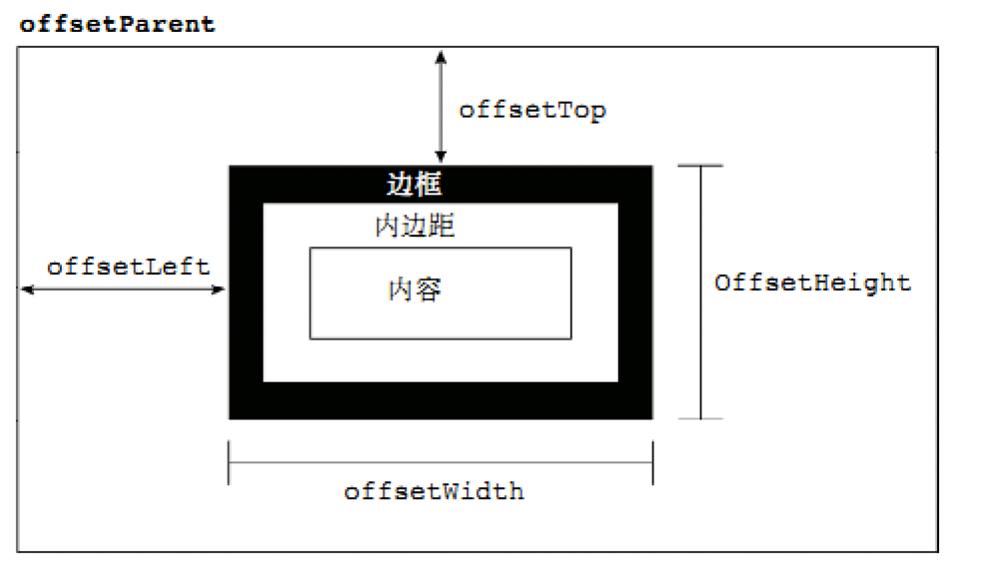
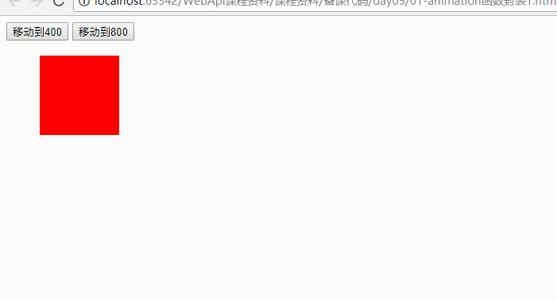
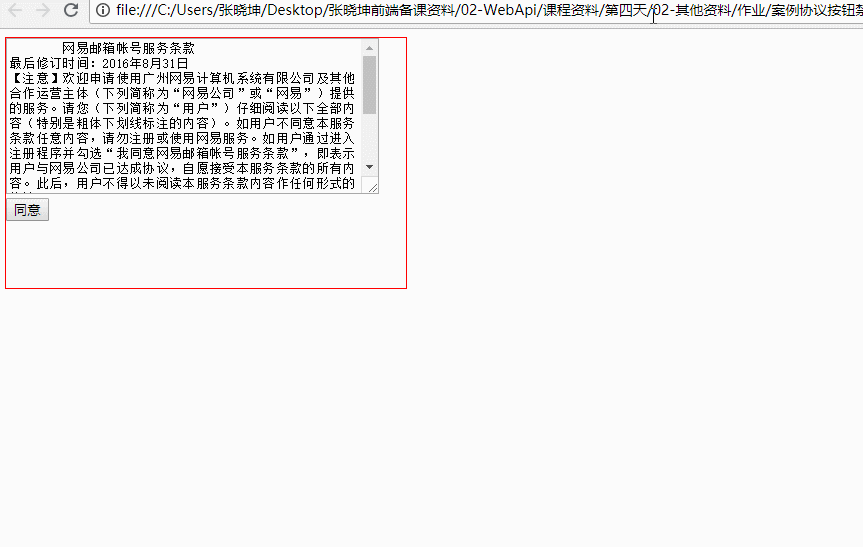

# 日学习任务

* [ ] ==1.定时器==
  * [ ] 定时器作用及语法
    * [ ] setInterval():重复定时器
    * [ ] setTimeout():一次定时器
* [ ] ==2.定时器的应用场景案例==
  * [ ] ==秒杀==
  * [ ] ==动画==
* [ ] ==3.匀速动画封装==
  * [ ] a.offset家族获取元素位置
  * [ ] b.匀速动画封装
    * [ ] a.代码冗余-函数
    * [ ] b.移动距离不限：函数参数
    * [ ] c.移动元素不限
    * [ ] d.移动方向不限


# ==01-定时器作用及语法==

## 1.1-setInterval


定时器：某一件事（一段代码）并不是马上执行，而是隔一段时间执行

* setInterval:创建定时器
  * 特点：一旦创建立即计时，必须要手动停止，否则会无限的每隔一段时间执行代码
* clearInterval(定时器id)：清除定时器
  * 一个页面可以创建很多个定时器，通过制定定时器id可以清除特定的定时器


```html
<!DOCTYPE html>
<html>
<head lang="en">
    <meta charset="UTF-8">
    <title></title>

</head>
<body>

<input type="button" value="开始" id="start">
<input type="button" value="结束" id="end">
<br>
<p id="p1"></p>

<script>
    /*定时器：某一件事（一段代码）并不是马上执行，而是隔一段时间执行
    setInterval:创建定时器
        * 特点：一旦创建立即计时，必须要手动停止，否则会无限的每隔一段时间执行代码
    clearInterval(定时器id)：清除定时器
        * 一个页面可以创建很多个定时器，通过制定定时器id可以清除特定的定时器
     */

    //获取界面元素
    var p1 = document.getElementById('p1');
    var start = document.getElementById('start');
    var end = document.getElementById('end');
    var i = 0;//定义一个变量来查看定时器执行次数
    var timerID;//定义一个变量来存储定时器的id
    start.onclick = function (  ) {
        //1.创建一个定时器
        /**
         * @param handler:要执行的一段代码  （函数）
         * @param timeout：时间间隔 单位毫秒（number）
         * @return timeID：这个定时器的id （number）  代码中可以创建很多个定时器，这个timeID就是区分你的定时器
         */
       timerID = setInterval(function (  ) {
            //这段代码每隔1秒钟会执行一次
            console.log ( "我是定时器" );
            p1.innerText = i++;
        },1000)
    }

    //2.结束定时器
    end.onclick = function (  ) {
        console.log ( timerID );
        clearInterval(timerID);
    }

</script>
</body>
</html>
```


## 1.2-setTimeout

* 定时器setTimeout与setInterval唯一的区别是，setTimeout定时器只会执行一次
* 总结：
  * 1.如果你想让这个代码一段时间后只执行一次，使用setTimeout
  * 2.如果你想让这个代码每隔一段时间执行一次（执行多次），使用setInterval

```html
<!DOCTYPE html>
<html lang="en">
<head>
    <meta charset="UTF-8">
    <title>Title</title>
</head>

<input type="button" value="开始" id="start"/>

<body>
<script>
    /*定时器setTimeout与setInterval唯一的区别是，setTimeout定时器只会执行一次
    总结：1.如果你想让这个代码一段时间后只执行一次，使用setTimeout
    2.如果你想让这个代码每隔一段时间执行一次（执行多次），使用setInterval
     */
    document.getElementById('start').onclick = function (  ) {
        /**
         * @param handler:要执行的一段代码  （函数）
         * @param timeout：时间间隔 单位毫秒（number）
         * @return timeID:   setTimeout执行一次之后会自动关闭，所以一般不用
        */
        setTimeout(function (  ) {
            //这个代码2秒后执行一次，执行完毕之后定时器自动关闭
            console.log ( "哈哈" );
        },2000);
    }
</script>
</body>
</html>
```


# 02-定时器的场景案例

## ==1.1-倒计时秒杀==

[效果预览](file:///C:/Users/%E5%BC%A0%E6%99%93%E5%9D%A4/Desktop/%E5%BC%A0%E6%99%93%E5%9D%A4%E5%89%8D%E7%AB%AF%E5%A4%87%E8%AF%BE%E8%B5%84%E6%96%99/AB%E6%A8%A1%E5%BC%8F/03-WebApi/%E8%AF%BE%E7%A8%8B%E8%B5%84%E6%96%99/%E5%A4%87%E8%AF%BE%E4%BB%A3%E7%A0%81/day05/03-%E5%80%92%E8%AE%A1%E6%97%B6%E7%A7%92%E6%9D%80.html)


* 思路分析

​	开启定时器，1s
​        	1.先获取页面元素的文本   h m s
​        	2.每过1s，s--
​        	3.如果s < 0, s = 59, m--
​        	4.如果m < 0, m = 59, h--
​        	5.如果 h m s < 10,则在前面加上0
​        	6.将计算的h m s 结果，显示到页面元素中
​        	7.如果h == 0 && m == 0 && s == 0


```html
<!DOCTYPE html>
<html lang="en">

<head>
    <meta charset="UTF-8">
    <meta name="viewport" content="width=device-width, initial-scale=1.0">
    <meta http-equiv="X-UA-Compatible" content="ie=edge">
    <title>Document</title>
</head>

<body>
    <span id="spanHour">03</span>
    <span>:</span>
    <span id="spanMin">06</span>
    <span>:</span>
    <span id="spanSec">15</span>


    <script>
        /*秒杀思路分析 
        开启定时器，1s
        1.先获取页面元素的文本   h m s
        2.每过1s，s--
        3.如果s < 0, s = 59, m--
        4.如果m < 0, m = 59, h--
        5.如果 h m s < 10,则在前面加上0
        6.将计算的h m s 结果，显示到页面元素中
        7.如果h == 0 && m == 0 && s == 0
        */

        //开启1s的定时器
        var timeID = setInterval(function(){
            //1.先获取页面元素的文本   h m s
            var spanHour = document.getElementById('spanHour');
            var spanMin = document.getElementById('spanMin');
            var spanSec = document.getElementById('spanSec');

            var h = spanHour.innerText;
            var m = spanMin.innerText;
            var s = spanSec.innerText;
            //2.每过1s，s--
            s--;
            //3.如果s < 0, s = 59, m--
            if(s < 0){
                s = 59;
                m--;
            }
            //4.如果m < 0, m = 59, h--
            if(m < 0){
                m = 59;
                h--;
            };
            //5.如果 h m s < 10,则在前面加上0
            //字符串类型在参数数学计算的时候，最好先转成number类型
            h = parseInt(h);
            m = parseInt(m);
            s = parseInt(s);

            // 表达式?代码1:代码2
            h = h < 10?'0' + h:h;
            m = m < 10?'0' + m:m;
            s = s < 10?'0' + s:s;

        
            //6.将计算的h m s 结果，显示到页面元素中
            spanHour.innerText = h;
            spanMin.innerText = m;
            spanSec.innerText = s;
            //7.如果h == 0 && m == 0 && s == 0
            if(h == 0 && m == 0 && s == 0){
                clearInterval(timeID);
            };
        },1000);
    </script>
</body>

</html>

```


## 1.2-整点秒杀

[效果预览](file:///C:/Users/张晓坤/Desktop/张晓坤前端备课资料/AB模式/03-WebApi/课程资料/备课代码/day05/04-整点秒杀.html)


```html
<!DOCTYPE html>
<html>

<head lang="en">
  <meta charset="UTF-8">
  <title>Document</title>
  <span  id="currentTime"></span>
  <br>
  <span  > 20:00:00结束</span>

  
</head>

<body>

  <script>
    /*思路分析 
  开启一个永久定时器。时间间隔1s。
  (1).获取当前的时分秒
  (2).每过1s， s++
  (3). 如果s > 59, s = 0,m++
  (4) 如果 m > 59, m = 0,h++
  (5)如果hms < 10，则在前面加上0  
  (5)将计算好的时分秒hms赋值给页面元素文本
  (6)如果 s == 20 && m == 0 && h == 0,清除定时器
*/

    var timeID = setInterval(function () {
      //(1).获取当前的时分秒
      var date = new Date();
      var h = date.getHours();
      var m = date.getMinutes();
      var s = date.getSeconds();
      //(2).每过1s， s++
      s++;
      //(3). 如果s > 59, s = 0,m++
      if (s > 59) {
        s = 0;
        m++;
      };
      //(4) 如果 m > 59, m = 0,h++
      if (m > 59) {
        m = 0;
        h++;
      };

      //(5)如果h m s < 10，则在前面加上0 
      /*注意点： 不要直接用字符串和数字计算，应该先转成number类型 */
      s = parseInt(s);
      m = parseInt(m);
      h = parseInt(h);
      s = s < 10 ? '0' + s : s;
      m = m < 10 ? '0' + m : m;
      h = h < 10 ? '0' + h : h;
      //(6)将计算好的时分秒hms赋值给页面元素文本
      document.getElementById('currentTime').innerText = h + ':' + m + ":" + s;
      //(7)如果 s == 20 && m == 0 && h == 0,清除定时器
      if (s == 20 && m == 0 && h == 0) {
        clearInterval(timeID);
      }
    }, 1000)

  </script>
</body>

</html>
```


## 1.3-动画介绍

[效果预览](file:///C:/Users/%E5%BC%A0%E6%99%93%E5%9D%A4/Desktop/%E5%BC%A0%E6%99%93%E5%9D%A4%E5%89%8D%E7%AB%AF%E5%A4%87%E8%AF%BE%E8%B5%84%E6%96%99/%E5%85%A8%E5%A4%A9%E6%A8%A1%E5%BC%8F/02-WebApi/%E8%AF%BE%E7%A8%8B%E8%B5%84%E6%96%99/%E5%A4%87%E8%AF%BE%E4%BB%A3%E7%A0%81/day04/04-%E5%8A%A8%E7%94%BB%E6%A1%88%E4%BE%8B%EF%BC%9A%E5%B9%B3%E7%A7%BB%E5%8A%A8%E7%94%BB.html)


* 需求：点击开始按钮，让div向右移动800px ，动画效果
* 动画可以理解为物理中的运动，运动三要素：v = s/t （速度 = 距离/时间）
  * 如果没有时间因素，则会造成瞬移效果
* 1.如果直接修改div的left值就会瞬间移动，没有动画效果
* 2.动画效果：让div的left值每隔一段时间向右移动一点，直到移动800为止


```html
<!DOCTYPE html>
<html>
<head lang="en">
    <meta charset="UTF-8">
    <title>标题</title>
    <style>
        .one {
            width: 100px;
            height: 100px;
            background-color: pink;
            position: absolute;
            top: 50px;
            left: 0px;
        }
    </style>
</head>
<body>
<input type="button" value="开始" id="start"/>
<div class="one" id="box"></div>
</body>

<script>
    /*需求：点击开始按钮，让div向右移动800px ，动画效果

    动画可以理解为物理中的运动，运动三要素：v = s/t  （速度 = 距离/时间）
        * 如果没有时间因素，则会造成瞬移效果
        *
    1.如果直接修改div的left值就会瞬间移动，没有动画效果
    2.动画效果：让div的left值每隔一段时间向右移动一点，直到移动800为止
    * */

    //1.获取div
    var div = document.getElementById('box');

    // //直接修改div的left值就会瞬间移动，没有动画
    // document.getElementById('start').onclick = function (  ) {
    //     div.style.left = '800px';
    // }

    //2.利用定时器实现动画（setInterval）
    var timeID = null;//声明一个变量，用来记录定时器的id
    var currentLeft = 0 ;//声明一个变量，用来记录运动中当前的left值
    document.getElementById('start').onclick = function (  ) {
        timeID = setInterval(function (  ) {
            //定义一个距离因子来表示速度，每隔一段时间，当前距离会叠加这个因子
            //因子越小，动画越平缓
            var step = 9;
            currentLeft += step;
            div.style.left = currentLeft + 'px';

            //判断div是否达到目的地，否则会无限向右移动
            if(currentLeft >= 800){
                div.style.left = 800 + 'px';//到达终点
                clearInterval(timeID);//清除定时器，停止运动
            }

        },100);//间隔时间越小动画越平缓
    }

</script>
</html>
```


# 03-offset家族

* 1.offset属性家族：获取元素真实的宽高和位置
  * offsetWidth、offsetHeight、offsetParent、offsetLeft、offsetTop
* 2.之前学习的通过style属性获取宽高的特点
  * 1.只能获取行内的宽高
  * 2.获取到的值是一个string类型，并且带px
  * 3.获取到的只有宽高，不包含padding、border（总结就是行内写的是什么，获取的就是什么）
  * 4.既可以读取，也可以设置
* 3.offsetWidth与offsetHeight：获取的是元素的实际宽高 = width + border + padding
  * 1.可以获取行内及内嵌的宽高
  * 2.获取到的值是一个number类型，不带单位
  * 3.获取的宽高包含border和padding
  * 4.只能读取，不能设置



## 1.1-offsetWidth与offsetHeight


```html
<!DOCTYPE html>
<html lang="en">
<head>
    <meta charset="UTF-8">
    <title>Title</title>

    <style>
        .one{
            width: 100px;
            padding: 10px;
            border: 10px solid red;
        }
    </style>
</head>
<body>
<div id="box" class="one" style="height: 150px; background: pink; "></div>
</body>

<script>
    /*offset属性家族：获取元素真实的宽高和位置
        * offsetWidth、offsetHeight、offsetParent、offsetLeft、offsetTop
     */

    var box = document.getElementById('box');
    /*之前学习的通过style属性获取宽高的特点
    * 1.只能获取行内的宽高
    * 2.获取到的值是一个string类型，并且带px
    * 3.获取到的只有宽高，不包含padding、border（总结就是行内写的是什么，获取的就是什么）
    * 4.既可以读取，也可以设置
     */
    console.log ( box.style.width );
    console.log ( box.style.height );

    box.style.height = '100px';

    /*offsetEWidth与offsetHeight：获取的是元素的实际宽高 = width + border + padding
    1.可以获取行内及内嵌的宽高
    2.获取到的值是一个number类型，不带单位
    3.获取的宽高包含border和padding
    4.只能读取，不能设置
     */
    console.log ( box.offsetWidth );//width + border + padding
    console.log ( box.offsetHeight );//height + border + padding

    box.offsetWidth = 300;//手动设置无效：只能读取，不能设置。
</script>
</html>
```


## 1.2-offsetParent


```html
offsetParent:获取最近的定位父元素 （自己定位参照的父元素）
注意点：
1.如果元素自身是固定定位（fixed），则定位父级是null
2.如果元素自身是非固定定位,并且所有的父元素都没有定位，那么他的定位父级是body
3.body的定位父级是null

<!DOCTYPE html>
<html lang="en">
<head>
    <meta charset="UTF-8">
    <title>Title</title>
    <style>
        .one{
              top: 50px;
              left: 0px;
              width: 100px;
              height: 100px;
              background: greenyellow;
              position: absolute;
          }

        .two{
            top: 100px;
            left: 0;
            width: 200px;
            height: 200px;
            background: cyan;
            position: relative;
        }

        .three{
            top: 0;
            left: 0;
            width: 300px;
            height: 300px;
            background: green;
            position: relative;
        }
    </style>
</head>
<body>
<div class="three">
    <div class="two">
        <div class="one" id="box">1</div>
    </div>
</div>

</body>

<script>
    /*offsetParent:获取最近的定位父元素  （自己定位参照的父元素）
    //注意点：
    1.如果元素自身是固定定位，则定位父级是null
    2.如果元素自身是非固定定位,并且所有的父元素都没有定位，那么他的定位父级是body
    3.body的定位父级是null

     */

    var box = document.getElementById('box');
    console.log ( box.offsetParent );


    //如果是固定定位fixed，则父元素是null
    //原因：固定定位参照的是浏览器窗口，这不属于任何一个元素，所以是null
   // console.log ( box.offsetParent );//null

    //body自身的定位父元素是null
    console.log ( document.body.offsetParent );

</script>
</html>
```


## 1.3-offsetLeft和offsetTop


* offsetLeft:获取自己左外边框与offsetParent的左内边框的距离
* offsetTop:获取自己上外边框与offsetParent的上内边框的距离

```html
<!DOCTYPE html>
<html lang="en">
<head>
    <meta charset="UTF-8">
    <title>Title</title>
    <style>
        .one{
            top:50px;
            left: 50px;
            width: 100px;
            height: 100px;
            background: greenyellow;
            border: 10px solid red;
            margin: 20px;
            position: absolute;
        }

        .two{
            top: 200px;
            left: 200px;
            width: 200px;
            height: 200px;
            background: cyan;
            border: 20px solid purple;
            padding: 10px;
            position: absolute;
        }

    </style>
</head>
<body>
    <div class="two">
        <div class="one" id="box">1</div>
    </div>
</body>

<script>
    /*offsetLeft:获取自己左外边框与offsetParent的左内边框的距离
    offsetTop:获取自己上外边框与offsetParent的上内边框的距离
     */

    var box = document.getElementById('box');

    console.log ( box.offsetLeft );//70
    console.log ( box.offsetTop );//70
</script>
</html>
```


# 04-匀速动画封装


## 1.1-代码冗余-函数


```html
<!DOCTYPE html>
<html>
<head lang="en">
    <meta charset="UTF-8">
    <title></title>

    <style>
        #box {
            width: 100px;
            height: 100px;
            background-color: red;
            position: absolute;
            left: 50px;
            top: 50px;
        }
    </style>
</head>
<body>

<input type="button" value="移动到400" id="move400"/>
<input type="button" value="移动到800" id="move800"/>

<div id="box"></div>

</body>

<script>

    /*总结：目前的代码存在哪些问题？
   1.两个按钮点击事件的代码几乎一致（除了400与800），存在代码重复冗余
   2.移动的距离写死，如果需求变更为移动到1000，又要把代码复制粘贴一份
   3.移动的元素写死，只能移动box这个盒子，如果需求变成为要移动其他盒子则代码又要重新复制粘贴
   4.只能单向移动（只能从左往右，无法从右往左）
    */

    var box = document.getElementById('box');

    //声明一个timeID用于存储定时器的ID
    var timeID;
    document.getElementById('move400').onclick = function (  ) {
        //每次移动之前清除上一次的计时器
        clearInterval(timeID);

       timeID =  setInterval(function (  ) {
            //1.获取盒子当前位置
            var currentLeft = box.offsetLeft;
            //2.添加单次运动距离
            currentLeft += 10;
            //3.边界检测
            if(currentLeft < 400){
                //4.设置盒子的位置（offset家族只能读取不能设置）
                box.style.left = currentLeft + 'px';
            }else{
                box.style.left =  '400px';
            }
        },50);
    }

    document.getElementById('move800').onclick = function (  ) {

        //每次移动之前清除上一次的计时器
        clearInterval(timeID);

        setInterval(function (  ) {
            //1.获取盒子当前位置
            var currentLeft = box.offsetLeft;
            //2.添加单次运动距离
            currentLeft += 10;
            //3.边界检测
            if(currentLeft < 800){
                //4.设置盒子的位置（offset家族只能读取不能设置）
                box.style.left = currentLeft + 'px';
            }else{
                box.style.left =  '800px';
            }
        },50);
    }


</script>
</html>
```


## 1.2-移动距离不限-函数参数



```html
<!DOCTYPE html>
<html>
<head lang="en">
    <meta charset="UTF-8">
    <title></title>

    <style>
        #box {
            width: 100px;
            height: 100px;
            background-color: red;
            position: absolute;
            left: 50px;
            top: 50px;
        }
    </style>
</head>
<body>

<input type="button" value="移动到400" id="move400"/>
<input type="button" value="移动到800" id="move800"/>

<div id="box"></div>

</body>

<script>

    /*本小节解决问题：
    1.解决代码冗余问题：函数
    2.移动距离灵活：函数的参数（移动距离）

    */

    var box = document.getElementById('box');


    document.getElementById('move400').onclick = function (  ) {
       animateMove(400);
    }

    document.getElementById('move800').onclick = function (  ) {

        animateMove(800);
    }

    var timeID;
    function animateMove (target ) {
        //每次移动之前清除上一次的计时器
        clearInterval(timeID);
        //移动动画
       timeID=  setInterval(function (  ) {
            //1.获取盒子当前位置
            var currentLeft = box.offsetLeft;
            //2.添加单次运动距离
            currentLeft += 10;
            //3.边界检测
            if(currentLeft < target){
                //4.设置盒子的位置（offset家族只能读取不能设置）
                box.style.left = currentLeft + 'px';
            }else{
                box.style.left =  target + 'px';
            }
        },50);
    }


</script>
</html>
```


## 1.3-移动元素不限


```html
<!DOCTYPE html>
<html>
<head lang="en">
    <meta charset="UTF-8">
    <title></title>

    <style>
        #box1 {
            width: 100px;
            height: 100px;
            background-color: red;
            position: absolute;
            left: 50px;
            top: 50px;
        }

        #box2 {
            width: 100px;
            height: 100px;
            background-color: green;
            position: absolute;
            left: 50px;
            top: 200px;
        }
    </style>
</head>
<body>

<input type="button" value="移动到400" id="move400"/>
<input type="button" value="移动到800" id="move800"/>

<div id="box1"></div>
<div id="box2"></div>

</body>

<script>

    /*本小节解决问题：移动元素灵活，可以是任意元素
    思路：给函数添加一个参数，接收要移动的元素

    */

    var box1 = document.getElementById('box1');//红色盒子
    var box2 = document.getElementById('box2');//绿色盒子

    //点击移动红色盒子到400
    document.getElementById('move400').onclick = function (  ) {
        animateMove(box1,400);
    }

    //点击移动绿色盒子到800
    document.getElementById('move800').onclick = function (  ) {
        animateMove(box2,800);
    }

    //1.如果定义一个全局变量存储定时器id则会有一个bug：两个盒子无法同时移动，因为一个变量只能存储一个定时器id
   // var timeID;
    /*2.解决方案：谁要移动，我就给你一个定时器id，等你到达终点了我就回收定时器
    PS：跑步比赛，比赛之前给每一个选手一个编号贴在背上区分，比赛完了就回收
    */
    function animateMove (obj,target ) {
        //移动之前，如果元素已有定时器，则先清除
        clearInterval(obj.timeID);

        //移动动画:将定时器的id作为移动元素的属性
        obj.timeID=  setInterval(function (  ) {
            //1.获取盒子当前位置
            var currentLeft = obj.offsetLeft;
            //2.开始移动
            currentLeft += 10;
            //3.边界检测
            if(currentLeft < target){
                //4.设置盒子的位置（offset家族只能读取不能设置）
                obj.style.left = currentLeft + 'px';
            }else{
                obj.style.left =  target + 'px';
                //5.到达目的地之后移除定时器
                clearInterval(obj.timeID);
            }
        },50);
    }


</script>
</html>
```


## 1.4-移动方向不限

本小节解决问题：元素只能单向移动（只能从左往右，不能从右往左）

* 思路分析：
  * （1）从左往右移动情况 ： 目标位置 > 元素当前位置
  * （2）从右往左移动情况： 目标位置 < 元素当前位置


```html
<!DOCTYPE html>
<html>
<head lang="en">
    <meta charset="UTF-8">
    <title></title>

    <style>
        #box1 {
            width: 100px;
            height: 100px;
            background-color: red;
            position: absolute;
            left: 50px;
            top: 50px;
        }

        #box2 {
            width: 100px;
            height: 100px;
            background-color: green;
            position: absolute;
            left: 50px;
            top: 200px;
        }
    </style>
</head>
<body>

<input type="button" value="移动到400" id="move400"/>
<input type="button" value="移动到800" id="move800"/>

<div id="box1"></div>
<div id="box2"></div>

</body>

<script>

    /*本小节解决问题：元素只能单向移动（只能从左往右，不能从右往左）
    思路分析：（1）从左往右移动情况  ： 目标位置>元素当前位置
            （2）从右往左移动情况：  目标位置 < 元素当前位置
    */
    var box1 = document.getElementById('box1');//红色盒子
    var box2 = document.getElementById('box2');//绿色盒子

    //点击移动红色盒子到400
    document.getElementById('move400').onclick = function (  ) {
        animateMove(box1,400);
    }

    //点击移动绿色盒子到800
    document.getElementById('move800').onclick = function (  ) {
        animateMove(box1,800);
    }

    //1.如果定义一个全局变量存储定时器id则会有一个bug：两个盒子无法同时移动，因为一个变量只能存储一个定时器id
    // var timeID;
    /*2.解决方案：谁要移动，我就给你一个定时器id，等你到达终点了我就回收定时器
    PS：跑步比赛，比赛之前给每一个选手一个编号贴在背上区分，比赛完了就回收
    */
    function animateMove (obj,target ) {
        //移动之前，如果元素已有定时器，则先清除
        clearInterval(obj.timeID);

        //移动动画:将定时器的id作为移动元素的属性
        obj.timeID=  setInterval(function (  ) {
            //1.获取元素当前位置
            var currentLeft = obj.offsetLeft;
            //2.判断元素是向左移动还是向右移动

            var isLeft;
            if(currentLeft < target){
                //向右移动
                currentLeft += 10;
                isLeft = false;
            }else{
                //向左移动
                currentLeft -= 10;
                isLeft = true;
            }

            //3.边界检测
            /*如果是向右移动，检测规则是：if (当前距离 < 目标距离) 继续右移，否则直接回到目标距离
            如果是向左移动，检测规则是：if (当前距离 > 目标距离) 继续左移，否则直接回到目标距离
            * 解决方案：可以在第二步判断元素左移还是右移的时候声明一个变量，如果为true则表示左移，false表示右移
            isLeft == false?currentLeft < target:currentLeft > target
            * 这个三目运算的含义，如果是右移，返回currentLeft < target 条件表达式的结果。否则返回currentLeft > target条件表达式的结果
             */
            if(isLeft == false?currentLeft < target:currentLeft > target){
                //4.设置盒子的位置（offset家族只能读取不能设置）
                obj.style.left = currentLeft + 'px';
            }else{
                obj.style.left =  target + 'px';
                //5.到达目的地之后移除定时器
               clearInterval(obj.timeID);
            }
        },50);
    }


</script>
</html>
```


# 05-今日学习总结


* 1.定时器

  * setInterval
    * 1.一旦创建立即计时，必须要手动停止，否则会无限的每隔一段时间执行代码
    * 2.创建定时器：setInterval(函数,时间间隔)
      * 1.返回这个定时器的id
      * 2.时间间隔的单位是毫秒
      * 3.每隔一段时间就会执行函数中的代码
    * 3.移除定时器：clearInterval(定时器id)
  * setTimeout(函数,时间间隔);
    * 与setInterval唯一的区别就是这个定时器只会执行一次，之后会自动移除

* 


# 06-课后练习



